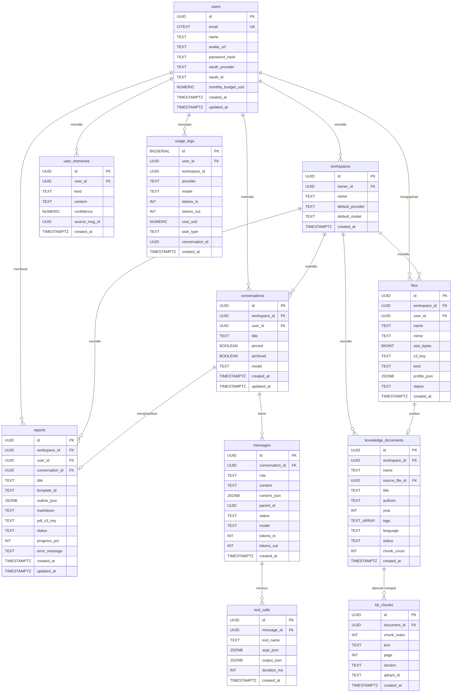

# 09 -- Database Schema

## Gambaran Umum

Dokumen ini menjelaskan skema database lengkap untuk uReport AI. Sistem menggunakan **PostgreSQL 16** sebagai database relasional utama, **Qdrant** sebagai vector database untuk fitur RAG (Retrieval-Augmented Generation), dan **Redis 7** untuk cache, queue, dan session management.

### Teknologi Database

| Komponen | Teknologi | Fungsi |
|----------|-----------|--------|
| Relasional | PostgreSQL 16 | Data utama, transaksi, relasi |
| Vektor | Qdrant | Embedding vectors untuk RAG |
| Cache/Queue | Redis 7 | Session, cache, Celery broker |
| Object Storage | S3/MinIO/R2 | File uploads, PDF reports |

### Konvensi Skema

- **Primary Key**: UUID v4 (gen_random_uuid()) untuk semua tabel utama, BIGSERIAL untuk log
- **Timestamps**: TIMESTAMPTZ dengan default now() -- selalu timezone-aware
- **Email**: CITEXT (case-insensitive text) untuk kolom email
- **JSON**: JSONB untuk field fleksibel (bukan JSON)
- **Soft Delete**: Tidak digunakan -- menggunakan hard delete dengan cascade
- **Naming**: snake_case untuk semua kolom dan tabel

---

## Entity-Relationship Diagram



---

## Definisi Tabel

### 1. Tabel `users`

Menyimpan informasi akun pengguna aplikasi.

| Column | Type | Constraints | Description |
|--------|------|-------------|-------------|
| `id` | `UUID` | PK, DEFAULT `gen_random_uuid()` | Identifier unik pengguna |
| `email` | `CITEXT` | UNIQUE, NOT NULL | Alamat email (case-insensitive) untuk login |
| `name` | `TEXT` | NULLABLE | Nama lengkap pengguna |
| `avatar_url` | `TEXT` | NULLABLE | URL foto profil (dari OAuth atau upload) |
| `password_hash` | `TEXT` | NULLABLE | Hash password (bcrypt) -- null jika OAuth-only |
| `oauth_provider` | `TEXT` | NULLABLE | Provider OAuth: `google` atau null |
| `oauth_id` | `TEXT` | NULLABLE | ID unik dari OAuth provider |
| `monthly_budget_usd` | `NUMERIC(8,2)` | DEFAULT `2.00` | Batas budget bulanan untuk pemakaian LLM |
| `created_at` | `TIMESTAMPTZ` | DEFAULT `now()` | Waktu akun dibuat |
| `updated_at` | `TIMESTAMPTZ` | DEFAULT `now()` | Waktu terakhir profil diupdate |

**SQL DDL:**

```sql
CREATE TABLE users (
    id                 UUID PRIMARY KEY DEFAULT gen_random_uuid(),
    email              CITEXT UNIQUE NOT NULL,
    name               TEXT,
    avatar_url         TEXT,
    password_hash      TEXT,
    oauth_provider     TEXT,
    oauth_id           TEXT,
    monthly_budget_usd NUMERIC(8,2) DEFAULT 2.00,
    created_at         TIMESTAMPTZ DEFAULT now(),
    updated_at         TIMESTAMPTZ DEFAULT now()
);
```

---

### 2. Tabel `workspaces`

Workspace mengelompokkan resource milik user. Di V1 setiap user memiliki satu workspace; di V2 mendukung multi-user workspace.

| Column | Type | Constraints | Description |
|--------|------|-------------|-------------|
| `id` | `UUID` | PK, DEFAULT `gen_random_uuid()` | Identifier unik workspace |
| `owner_id` | `UUID` | FK -> `users.id`, NOT NULL, ON DELETE CASCADE | Pemilik workspace |
| `name` | `TEXT` | NOT NULL | Nama workspace |
| `default_provider` | `TEXT` | NULLABLE | Default LLM provider (groq, openai, dll) |
| `default_model` | `TEXT` | NULLABLE | Default model name (llama-3.1-70b, dll) |
| `created_at` | `TIMESTAMPTZ` | DEFAULT `now()` | Waktu workspace dibuat |

**SQL DDL:**

```sql
CREATE TABLE workspaces (
    id               UUID PRIMARY KEY DEFAULT gen_random_uuid(),
    owner_id         UUID NOT NULL REFERENCES users(id) ON DELETE CASCADE,
    name             TEXT NOT NULL,
    default_provider TEXT,
    default_model    TEXT,
    created_at       TIMESTAMPTZ DEFAULT now()
);
```

---

### 3. Tabel `conversations`

Menyimpan setiap sesi percakapan (chat thread) antara user dan AI.

| Column | Type | Constraints | Description |
|--------|------|-------------|-------------|
| `id` | `UUID` | PK, DEFAULT `gen_random_uuid()` | Identifier unik conversation |
| `workspace_id` | `UUID` | FK -> `workspaces.id`, NOT NULL, ON DELETE CASCADE | Workspace tempat conversation berada |
| `user_id` | `UUID` | FK -> `users.id`, NOT NULL | User yang memulai conversation |
| `title` | `TEXT` | NULLABLE | Judul conversation (auto-generated dari pesan pertama) |
| `pinned` | `BOOLEAN` | DEFAULT `false` | Apakah conversation di-pin ke atas |
| `archived` | `BOOLEAN` | DEFAULT `false` | Apakah conversation di-archive |
| `model` | `TEXT` | NULLABLE | Override model default workspace |
| `created_at` | `TIMESTAMPTZ` | DEFAULT `now()` | Waktu conversation dibuat |
| `updated_at` | `TIMESTAMPTZ` | DEFAULT `now()` | Waktu pesan terakhir dikirim |

**SQL DDL:**

```sql
CREATE TABLE conversations (
    id             UUID PRIMARY KEY DEFAULT gen_random_uuid(),
    workspace_id   UUID NOT NULL REFERENCES workspaces(id) ON DELETE CASCADE,
    user_id        UUID NOT NULL REFERENCES users(id),
    title          TEXT,
    pinned         BOOLEAN DEFAULT false,
    archived       BOOLEAN DEFAULT false,
    model          TEXT,
    created_at     TIMESTAMPTZ DEFAULT now(),
    updated_at     TIMESTAMPTZ DEFAULT now()
);
```

---

### 4. Tabel `messages`

Menyimpan setiap pesan dalam percakapan, baik dari user, assistant, system, maupun tool.

| Column | Type | Constraints | Description |
|--------|------|-------------|-------------|
| `id` | `UUID` | PK, DEFAULT `gen_random_uuid()` | Identifier unik message |
| `conversation_id` | `UUID` | FK -> `conversations.id`, NOT NULL, ON DELETE CASCADE | Conversation tempat pesan berada |
| `role` | `TEXT` | NOT NULL | Role pengirim: `user`, `assistant`, `system`, `tool` |
| `content` | `TEXT` | NULLABLE | Isi pesan dalam format Markdown |
| `content_json` | `JSONB` | NULLABLE | Konten terstruktur (tool calls, attachments, charts) |
| `parent_id` | `UUID` | NULLABLE | ID pesan parent untuk threading/branching |
| `status` | `TEXT` | NULLABLE | Status streaming: `streaming`, `done`, `error` |
| `model` | `TEXT` | NULLABLE | Model yang menghasilkan respons ini |
| `tokens_in` | `INT` | NULLABLE | Jumlah input tokens yang digunakan |
| `tokens_out` | `INT` | NULLABLE | Jumlah output tokens yang dihasilkan |
| `created_at` | `TIMESTAMPTZ` | DEFAULT `now()` | Waktu pesan dibuat |

**SQL DDL:**

```sql
CREATE TABLE messages (
    id              UUID PRIMARY KEY DEFAULT gen_random_uuid(),
    conversation_id UUID NOT NULL REFERENCES conversations(id) ON DELETE CASCADE,
    role            TEXT NOT NULL,
    content         TEXT,
    content_json    JSONB,
    parent_id       UUID,
    status          TEXT,
    model           TEXT,
    tokens_in       INT,
    tokens_out      INT,
    created_at      TIMESTAMPTZ DEFAULT now()
);
```

---

### 5. Tabel `tool_calls`

Menyimpan audit setiap tool call yang dipicu oleh pesan assistant.

| Column | Type | Constraints | Description |
|--------|------|-------------|-------------|
| `id` | `UUID` | PK, DEFAULT `gen_random_uuid()` | Identifier unik tool call |
| `message_id` | `UUID` | FK -> `messages.id`, NOT NULL, ON DELETE CASCADE | Pesan yang memicu tool call |
| `tool_name` | `TEXT` | NOT NULL | Nama tool: `run_python`, `search_kb`, `generate_chart`, dll |
| `args_json` | `JSONB` | NULLABLE | Argumen yang dikirim ke tool |
| `output_json` | `JSONB` | NULLABLE | Output/hasil dari tool execution |
| `duration_ms` | `INT` | NULLABLE | Durasi eksekusi tool dalam milliseconds |
| `created_at` | `TIMESTAMPTZ` | DEFAULT `now()` | Waktu tool call dibuat |

**SQL DDL:**

```sql
CREATE TABLE tool_calls (
    id          UUID PRIMARY KEY DEFAULT gen_random_uuid(),
    message_id  UUID NOT NULL REFERENCES messages(id) ON DELETE CASCADE,
    tool_name   TEXT NOT NULL,
    args_json   JSONB,
    output_json JSONB,
    duration_ms INT,
    created_at  TIMESTAMPTZ DEFAULT now()
);
```

---

### 6. Tabel `files`

Menyimpan metadata file yang diupload user (data CSV/Excel untuk analisis).

| Column | Type | Constraints | Description |
|--------|------|-------------|-------------|
| `id` | `UUID` | PK, DEFAULT `gen_random_uuid()` | Identifier unik file |
| `workspace_id` | `UUID` | FK -> `workspaces.id`, NOT NULL, ON DELETE CASCADE | Workspace pemilik file |
| `user_id` | `UUID` | FK -> `users.id`, NOT NULL | User yang mengupload |
| `name` | `TEXT` | NOT NULL | Nama file asli (e.g., data_penjualan.xlsx) |
| `mime` | `TEXT` | NULLABLE | MIME type file |
| `size_bytes` | `BIGINT` | NULLABLE | Ukuran file dalam bytes |
| `s3_key` | `TEXT` | NOT NULL | Key/path di object storage (S3/MinIO/R2) |
| `kind` | `TEXT` | NULLABLE | Jenis file: `data`, `document`, `image` |
| `profile_json` | `JSONB` | NULLABLE | Hasil auto-profiling (schema, statistik, preview) |
| `status` | `TEXT` | DEFAULT `ready` | Status file: `uploading`, `ready`, `failed` |
| `created_at` | `TIMESTAMPTZ` | DEFAULT `now()` | Waktu file diupload |

**SQL DDL:**

```sql
CREATE TABLE files (
    id           UUID PRIMARY KEY DEFAULT gen_random_uuid(),
    workspace_id UUID NOT NULL REFERENCES workspaces(id) ON DELETE CASCADE,
    user_id      UUID NOT NULL REFERENCES users(id),
    name         TEXT NOT NULL,
    mime         TEXT,
    size_bytes   BIGINT,
    s3_key       TEXT NOT NULL,
    kind         TEXT,
    profile_json JSONB,
    status       TEXT DEFAULT 'ready',
    created_at   TIMESTAMPTZ DEFAULT now()
);
```

---

### 7. Tabel `knowledge_documents`

Menyimpan metadata dokumen yang diupload untuk knowledge base RAG (berbeda dari file data untuk analisis).

| Column | Type | Constraints | Description |
|--------|------|-------------|-------------|
| `id` | `UUID` | PK, DEFAULT `gen_random_uuid()` | Identifier unik dokumen |
| `workspace_id` | `UUID` | FK -> `workspaces.id`, NOT NULL, ON DELETE CASCADE | Workspace pemilik |
| `name` | `TEXT` | NULLABLE | Nama display dokumen |
| `source_file_id` | `UUID` | FK -> `files.id`, NULLABLE | File sumber (jika diupload via files) |
| `title` | `TEXT` | NULLABLE | Judul dokumen (dari metadata) |
| `authors` | `TEXT` | NULLABLE | Penulis dokumen |
| `year` | `INT` | NULLABLE | Tahun publikasi |
| `tags` | `TEXT[]` | NULLABLE | Array tag untuk filtering |
| `language` | `TEXT` | NULLABLE | Bahasa dokumen: `id`, `en` |
| `status` | `TEXT` | NULLABLE | Status indexing: `processing`, `ready`, `failed` |
| `chunk_count` | `INT` | NULLABLE | Jumlah chunks yang dihasilkan dari dokumen |
| `created_at` | `TIMESTAMPTZ` | DEFAULT `now()` | Waktu dokumen ditambahkan |

**SQL DDL:**

```sql
CREATE TABLE knowledge_documents (
    id             UUID PRIMARY KEY DEFAULT gen_random_uuid(),
    workspace_id   UUID NOT NULL REFERENCES workspaces(id) ON DELETE CASCADE,
    name           TEXT,
    source_file_id UUID REFERENCES files(id),
    title          TEXT,
    authors        TEXT,
    year           INT,
    tags           TEXT[],
    language       TEXT,
    status         TEXT,
    chunk_count    INT,
    created_at     TIMESTAMPTZ DEFAULT now()
);
```

---

### 8. Tabel `kb_chunks`

Menyimpan metadata chunk teks dari dokumen knowledge base. Vektor embedding disimpan terpisah di Qdrant.

| Column | Type | Constraints | Description |
|--------|------|-------------|-------------|
| `id` | `UUID` | PK, DEFAULT `gen_random_uuid()` | Identifier unik chunk |
| `document_id` | `UUID` | FK -> `knowledge_documents.id`, NOT NULL, ON DELETE CASCADE | Dokumen sumber chunk |
| `chunk_index` | `INT` | NULLABLE | Urutan chunk dalam dokumen (0-based) |
| `text` | `TEXT` | NULLABLE | Isi teks chunk |
| `page` | `INT` | NULLABLE | Nomor halaman asal (untuk PDF) |
| `section` | `TEXT` | NULLABLE | Nama section/heading asal |
| `qdrant_id` | `TEXT` | NULLABLE | ID vektor yang berkorespondensi di Qdrant |
| `created_at` | `TIMESTAMPTZ` | DEFAULT `now()` | Waktu chunk dibuat |

**SQL DDL:**

```sql
CREATE TABLE kb_chunks (
    id          UUID PRIMARY KEY DEFAULT gen_random_uuid(),
    document_id UUID NOT NULL REFERENCES knowledge_documents(id) ON DELETE CASCADE,
    chunk_index INT,
    text        TEXT,
    page        INT,
    section     TEXT,
    qdrant_id   TEXT,
    created_at  TIMESTAMPTZ DEFAULT now()
);
```

---

### 9. Tabel `reports`

Menyimpan laporan yang di-generate oleh AI, termasuk status pipeline dan artifact.

| Column | Type | Constraints | Description |
|--------|------|-------------|-------------|
| `id` | `UUID` | PK, DEFAULT `gen_random_uuid()` | Identifier unik report |
| `workspace_id` | `UUID` | FK -> `workspaces.id`, NOT NULL, ON DELETE CASCADE | Workspace pemilik |
| `user_id` | `UUID` | FK -> `users.id`, NOT NULL | User yang membuat report |
| `conversation_id` | `UUID` | FK -> `conversations.id`, NULLABLE | Conversation asal (jika dibuat dari chat) |
| `title` | `TEXT` | NULLABLE | Judul laporan |
| `template_id` | `TEXT` | NULLABLE | ID template yang digunakan |
| `outline_json` | `JSONB` | NULLABLE | Outline/struktur laporan yang direncanakan |
| `markdown` | `TEXT` | NULLABLE | Konten final dalam format Markdown |
| `pdf_s3_key` | `TEXT` | NULLABLE | Key di S3 untuk file PDF yang sudah dirender |
| `status` | `TEXT` | NULLABLE | Status pipeline: `created`, `planning`, `writing`, `rendering`, `done`, `failed` |
| `progress_pct` | `INT` | DEFAULT `0` | Persentase progress (0-100) |
| `error_message` | `TEXT` | NULLABLE | Pesan error jika gagal |
| `created_at` | `TIMESTAMPTZ` | DEFAULT `now()` | Waktu report dibuat |
| `updated_at` | `TIMESTAMPTZ` | DEFAULT `now()` | Waktu terakhir diupdate |

**SQL DDL:**

```sql
CREATE TABLE reports (
    id              UUID PRIMARY KEY DEFAULT gen_random_uuid(),
    workspace_id    UUID NOT NULL REFERENCES workspaces(id) ON DELETE CASCADE,
    user_id         UUID NOT NULL REFERENCES users(id),
    conversation_id UUID REFERENCES conversations(id),
    title           TEXT,
    template_id     TEXT,
    outline_json    JSONB,
    markdown        TEXT,
    pdf_s3_key      TEXT,
    status          TEXT,
    progress_pct    INT DEFAULT 0,
    error_message   TEXT,
    created_at      TIMESTAMPTZ DEFAULT now(),
    updated_at      TIMESTAMPTZ DEFAULT now()
);
```

---

### 10. Tabel `usage_logs`

Mencatat setiap penggunaan LLM untuk tracking cost dan quota. Menggunakan `BIGSERIAL` karena volume tinggi.

| Column | Type | Constraints | Description |
|--------|------|-------------|-------------|
| `id` | `BIGSERIAL` | PK | Auto-increment identifier (high volume) |
| `user_id` | `UUID` | NOT NULL | User yang menggunakan |
| `workspace_id` | `UUID` | NULLABLE | Workspace konteks (nullable untuk system calls) |
| `provider` | `TEXT` | NULLABLE | LLM provider: `groq`, `openai`, `anthropic`, `google` |
| `model` | `TEXT` | NULLABLE | Nama model: `llama-3.1-70b`, `gpt-4o`, dll |
| `tokens_in` | `INT` | NULLABLE | Jumlah input tokens |
| `tokens_out` | `INT` | NULLABLE | Jumlah output tokens |
| `cost_usd` | `NUMERIC(10,6)` | NULLABLE | Biaya dalam USD (presisi 6 desimal) |
| `task_type` | `TEXT` | NULLABLE | Jenis task: `chat`, `data_analysis`, `report_writer`, `rag_search` |
| `conversation_id` | `UUID` | NULLABLE | Conversation terkait (jika ada) |
| `created_at` | `TIMESTAMPTZ` | DEFAULT `now()` | Waktu log dibuat |

**SQL DDL:**

```sql
CREATE TABLE usage_logs (
    id              BIGSERIAL PRIMARY KEY,
    user_id         UUID NOT NULL,
    workspace_id    UUID,
    provider        TEXT,
    model           TEXT,
    tokens_in       INT,
    tokens_out      INT,
    cost_usd        NUMERIC(10,6),
    task_type       TEXT,
    conversation_id UUID,
    created_at      TIMESTAMPTZ DEFAULT now()
);
```

---

### 11. Tabel `user_memories`

Menyimpan long-term memory per user untuk personalisasi AI. Dikelola oleh memory agent.

| Column | Type | Constraints | Description |
|--------|------|-------------|-------------|
| `id` | `UUID` | PK, DEFAULT `gen_random_uuid()` | Identifier unik memory |
| `user_id` | `UUID` | FK -> `users.id`, NOT NULL, ON DELETE CASCADE | User pemilik memory |
| `kind` | `TEXT` | NULLABLE | Jenis memory: `fact`, `preference`, `goal` |
| `content` | `TEXT` | NULLABLE | Isi memory dalam natural language |
| `confidence` | `NUMERIC(3,2)` | NULLABLE | Skor confidence (0.00 - 1.00) |
| `source_msg_id` | `UUID` | NULLABLE | ID message yang menjadi sumber memory |
| `created_at` | `TIMESTAMPTZ` | DEFAULT `now()` | Waktu memory dibuat |

**SQL DDL:**

```sql
CREATE TABLE user_memories (
    id            UUID PRIMARY KEY DEFAULT gen_random_uuid(),
    user_id       UUID NOT NULL REFERENCES users(id) ON DELETE CASCADE,
    kind          TEXT,
    content       TEXT,
    confidence    NUMERIC(3,2),
    source_msg_id UUID,
    created_at    TIMESTAMPTZ DEFAULT now()
);
```

---

## Struktur Field JSONB

### `files.profile_json` -- Hasil Auto-Profiling Data

Ketika user mengupload file CSV/Excel, sistem otomatis melakukan profiling dan menyimpan hasilnya:

```json
{
  "columns": [
    {
      "name": "tanggal",
      "dtype": "datetime64[ns]",
      "nullable": false,
      "unique_count": 365,
      "sample_values": ["2024-01-01", "2024-01-02", "2024-01-03"]
    },
    {
      "name": "produk",
      "dtype": "object",
      "nullable": false,
      "unique_count": 15,
      "sample_values": ["Widget A", "Widget B", "Gadget X"]
    },
    {
      "name": "jumlah",
      "dtype": "int64",
      "nullable": false,
      "unique_count": 98,
      "min": 1,
      "max": 500,
      "mean": 125.4,
      "std": 45.2
    },
    {
      "name": "harga_satuan",
      "dtype": "float64",
      "nullable": true,
      "null_count": 12,
      "unique_count": 45,
      "min": 5000.0,
      "max": 250000.0,
      "mean": 45000.0
    }
  ],
  "row_count": 1200,
  "col_count": 4,
  "file_size_bytes": 45678,
  "sheet_names": ["Sheet1", "Data Penjualan"],
  "active_sheet": "Sheet1",
  "preview_rows": [
    {"tanggal": "2024-01-01", "produk": "Widget A", "jumlah": 150, "harga_satuan": 25000.0},
    {"tanggal": "2024-01-01", "produk": "Widget B", "jumlah": 80, "harga_satuan": 45000.0}
  ]
}
```

### `reports.outline_json` -- Outline Laporan

Struktur rencana laporan yang dibuat AI sebelum menulis konten:

```json
{
  "title": "Analisis Penjualan Q1 2024",
  "template": "business_report",
  "sections": [
    {
      "order": 1,
      "title": "Ringkasan Eksekutif",
      "description": "Overview singkat temuan utama",
      "estimated_words": 300,
      "data_sources": ["file_abc123"],
      "charts_planned": ["line_chart_revenue"]
    },
    {
      "order": 2,
      "title": "Analisis Trend Penjualan",
      "description": "Trend penjualan bulanan per kategori produk",
      "estimated_words": 800,
      "data_sources": ["file_abc123"],
      "charts_planned": ["bar_chart_monthly", "line_chart_trend"]
    },
    {
      "order": 3,
      "title": "Segmentasi Pelanggan",
      "description": "Analisis pelanggan berdasarkan volume dan frekuensi",
      "estimated_words": 600,
      "data_sources": ["file_abc123", "file_def456"],
      "charts_planned": ["pie_chart_segments"]
    },
    {
      "order": 4,
      "title": "Kesimpulan dan Rekomendasi",
      "description": "Rangkuman dan saran aksi",
      "estimated_words": 400,
      "data_sources": [],
      "charts_planned": []
    }
  ],
  "total_estimated_words": 2100,
  "language": "id",
  "style": "formal"
}
```

### `messages.content_json` -- Konten Terstruktur

Digunakan ketika pesan memiliki konten kompleks (multi-modal):

```json
{
  "type": "structured_response",
  "blocks": [
    {
      "type": "text",
      "content": "Berikut hasil analisis data penjualan Anda:"
    },
    {
      "type": "chart",
      "chart_id": "chart_abc123",
      "chart_type": "bar",
      "title": "Penjualan per Bulan"
    },
    {
      "type": "table",
      "columns": ["Bulan", "Revenue", "Growth"],
      "rows": [
        ["Jan", "Rp 150M", "+12%"],
        ["Feb", "Rp 180M", "+20%"],
        ["Mar", "Rp 165M", "-8%"]
      ]
    },
    {
      "type": "text",
      "content": "Dari data di atas, terlihat adanya penurunan di bulan Maret..."
    },
    {
      "type": "citation",
      "document_id": "doc_xyz",
      "chunk_id": "chunk_456",
      "page": 12,
      "text": "Menurut laporan industri 2023..."
    }
  ],
  "attachments": ["file_abc123"],
  "citations": ["doc_xyz"]
}
```

### `tool_calls.args_json` -- Argumen Tool Call

Contoh untuk tool `run_python`:

```json
{
  "code": "import pandas as pd
df = pd.read_csv('/data/file_abc123.csv')
result = df.groupby('produk').agg({'jumlah': 'sum', 'harga': 'mean'})
print(result.to_markdown())",
  "timeout_seconds": 30,
  "file_ids": ["file_abc123"]
}
```

Contoh untuk tool `search_kb`:

```json
{
  "query": "metode analisis regresi linear",
  "top_k": 5,
  "filters": {
    "workspace_id": "ws_123",
    "language": "id",
    "tags": ["statistik", "metodologi"]
  },
  "score_threshold": 0.7
}
```

### `tool_calls.output_json` -- Output Tool Call

```json
{
  "success": true,
  "stdout": "| produk   | jumlah | harga    |
|----------|--------|----------|
| Widget A |  1500  | 25000.0  |
| Widget B |   800  | 45000.0  |",
  "stderr": "",
  "charts": [
    {
      "type": "bar",
      "data": [{"produk": "Widget A", "jumlah": 1500}, {"produk": "Widget B", "jumlah": 800}],
      "config": {"xAxis": "produk", "yAxis": "jumlah"}
    }
  ],
  "execution_time_ms": 450
}
```

---

## Strategi Index

### Index Utama

```sql
-- === USERS ===
-- Email lookup untuk login (CITEXT sudah case-insensitive)
CREATE UNIQUE INDEX idx_users_email ON users(email);

-- === WORKSPACES ===
-- Cari workspace milik user
CREATE INDEX idx_workspaces_owner_id ON workspaces(owner_id);

-- === CONVERSATIONS ===
-- List conversations terbaru dalam workspace (sidebar chat)
CREATE INDEX idx_conversations_workspace_updated
    ON conversations(workspace_id, updated_at DESC);

-- Filter conversations yang di-pin
CREATE INDEX idx_conversations_pinned
    ON conversations(workspace_id)
    WHERE pinned = true;

-- Filter conversations yang belum di-archive
CREATE INDEX idx_conversations_active
    ON conversations(workspace_id, updated_at DESC)
    WHERE archived = false;

-- === MESSAGES ===
-- Load semua pesan dalam conversation (urut waktu)
CREATE INDEX idx_messages_conversation_created
    ON messages(conversation_id, created_at ASC);

-- Cari pesan berdasarkan status (untuk cleanup streaming yang gagal)
CREATE INDEX idx_messages_status
    ON messages(status)
    WHERE status = 'streaming';

-- === TOOL CALLS ===
-- List tool calls per message
CREATE INDEX idx_tool_calls_message_id ON tool_calls(message_id);

-- Analisis penggunaan tool (aggregate per tool_name)
CREATE INDEX idx_tool_calls_tool_name ON tool_calls(tool_name, created_at);

-- === FILES ===
-- List files dalam workspace
CREATE INDEX idx_files_workspace_id ON files(workspace_id, created_at DESC);

-- Cari file berdasarkan status (monitoring upload)
CREATE INDEX idx_files_status
    ON files(status)
    WHERE status = 'uploading';

-- === KNOWLEDGE DOCUMENTS ===
-- List documents dalam workspace
CREATE INDEX idx_knowledge_docs_workspace
    ON knowledge_documents(workspace_id, created_at DESC);

-- Filter berdasarkan status processing
CREATE INDEX idx_knowledge_docs_status
    ON knowledge_documents(status)
    WHERE status = 'processing';

-- Search by tags (GIN index untuk array)
CREATE INDEX idx_knowledge_docs_tags
    ON knowledge_documents USING GIN(tags);

-- === KB CHUNKS ===
-- Load chunks per document (urut)
CREATE INDEX idx_kb_chunks_document_index
    ON kb_chunks(document_id, chunk_index ASC);

-- Lookup by qdrant_id (untuk sync balik dari Qdrant)
CREATE INDEX idx_kb_chunks_qdrant_id ON kb_chunks(qdrant_id);

-- === REPORTS ===
-- List reports milik user
CREATE INDEX idx_reports_user_created
    ON reports(user_id, created_at DESC);

-- List reports dalam workspace
CREATE INDEX idx_reports_workspace
    ON reports(workspace_id, created_at DESC);

-- Monitor report yang sedang diproses
CREATE INDEX idx_reports_status
    ON reports(status)
    WHERE status IN ('planning', 'writing', 'rendering');

-- === USAGE LOGS ===
-- Query usage per user (billing dashboard)
CREATE INDEX idx_usage_logs_user_created
    ON usage_logs(user_id, created_at DESC);

-- Query usage per workspace
CREATE INDEX idx_usage_logs_workspace_created
    ON usage_logs(workspace_id, created_at DESC);

-- Aggregate cost per provider/model (analytics)
CREATE INDEX idx_usage_logs_provider_model
    ON usage_logs(provider, model, created_at);

-- === USER MEMORIES ===
-- Load memories per user
CREATE INDEX idx_user_memories_user
    ON user_memories(user_id, created_at DESC);

-- Filter by kind
CREATE INDEX idx_user_memories_kind
    ON user_memories(user_id, kind);
```

### Catatan Strategi Index

1. **Partial Indexes**: Digunakan untuk kolom status yang hanya perlu di-query pada value tertentu. Menghemat ruang disk dan mempercepat query spesifik.

2. **Composite Indexes**: Kolom yang sering digunakan bersama dalam WHERE + ORDER BY digabung dalam satu index untuk menghindari index scan ganda.

3. **GIN Index**: Digunakan untuk kolom array (`tags TEXT[]`) agar bisa query `@>` (contains) dengan efisien.

4. **DESC vs ASC**: Index pada `updated_at DESC` dan `created_at DESC` karena UI selalu menampilkan data terbaru dulu.

5. **Tidak ada index pada FK secara default**: PostgreSQL tidak otomatis membuat index pada foreign key. Semua FK yang sering di-JOIN sudah ditambahkan index manual di atas.

---

## Qdrant Vector Database

uReport AI menggunakan **Qdrant** sebagai vector database terpisah dari PostgreSQL. Vektor embedding untuk RAG disimpan di Qdrant, sedangkan metadata chunk tetap di PostgreSQL (tabel `kb_chunks`).

### Mengapa Qdrant (bukan pgvector)?

| Aspek | Qdrant | pgvector |
|-------|--------|----------|
| Performa ANN search | Sangat cepat (HNSW native) | Lebih lambat pada skala besar |
| Filtering | Payload filtering built-in | Perlu composite index kompleks |
| Skalabilitas | Horizontal scaling (sharding) | Terikat single PostgreSQL instance |
| Memory management | Optimized untuk vector ops | Berbagi memory dengan OLTP |
| Operasional | Terpisah, tidak membebani PG | Menambah load ke PG |

### Collection Schema: `kb_embeddings`

```json
{
  "collection_name": "kb_embeddings",
  "vectors": {
    "size": 1024,
    "distance": "Cosine"
  },
  "optimizers_config": {
    "default_segment_number": 4,
    "indexing_threshold": 20000
  },
  "hnsw_config": {
    "m": 16,
    "ef_construct": 128,
    "full_scan_threshold": 10000
  },
  "on_disk_payload": false
}
```

### Embedding Model

- **Model**: BAAI/bge-m3
- **Dimensi**: 1024
- **Bahasa**: Multilingual (optimal untuk Bahasa Indonesia dan English)
- **Distance Metric**: Cosine similarity

### Payload Fields per Point

Setiap vektor di Qdrant menyimpan payload metadata berikut:

| Field | Type | Description |
|-------|------|-------------|
| `chunk_id` | `string` (UUID) | ID chunk di PostgreSQL (`kb_chunks.id`) |
| `document_id` | `string` (UUID) | ID dokumen di PostgreSQL |
| `workspace_id` | `string` (UUID) | Workspace pemilik (untuk filtering multi-tenant) |
| `chunk_index` | `integer` | Urutan chunk dalam dokumen |
| `page` | `integer` | Nomor halaman (nullable) |
| `section` | `string` | Section heading (nullable) |
| `language` | `string` | Bahasa chunk: `id`, `en` |
| `tags` | `string[]` | Tags dari parent document |
| `year` | `integer` | Tahun publikasi dokumen |
| `text_preview` | `string` | 200 karakter pertama chunk (untuk preview) |

### Contoh Point di Qdrant

```json
{
  "id": "550e8400-e29b-41d4-a716-446655440000",
  "vector": [0.0123, -0.0456, 0.0789, ...],
  "payload": {
    "chunk_id": "550e8400-e29b-41d4-a716-446655440000",
    "document_id": "7c9e6679-7425-40de-944b-e07fc1f90ae7",
    "workspace_id": "a0eebc99-9c0b-4ef8-bb6d-6bb9bd380a11",
    "chunk_index": 3,
    "page": 5,
    "section": "Metodologi Penelitian",
    "language": "id",
    "tags": ["statistik", "penelitian"],
    "year": 2023,
    "text_preview": "Penelitian ini menggunakan metode mixed-method dengan pendekatan sequential explanatory..."
  }
}
```

### Query Pattern

```python
from qdrant_client import QdrantClient
from qdrant_client.models import Filter, FieldCondition, MatchValue

client = QdrantClient(host="localhost", port=6333)

# Search dengan workspace filtering (multi-tenant isolation)
results = client.search(
    collection_name="kb_embeddings",
    query_vector=query_embedding,  # [float] * 1024
    query_filter=Filter(
        must=[
            FieldCondition(
                key="workspace_id",
                match=MatchValue(value="a0eebc99-9c0b-4ef8-bb6d-6bb9bd380a11")
            )
        ]
    ),
    limit=5,
    score_threshold=0.7,
    with_payload=True
)
```

### HNSW Configuration

| Parameter | Value | Alasan |
|-----------|-------|--------|
| `m` | 16 | Balance antara recall dan memory usage |
| `ef_construct` | 128 | Build quality tinggi untuk akurasi search |
| `ef` (query time) | 64-128 | Disesuaikan per-query berdasarkan kebutuhan |
| `full_scan_threshold` | 10000 | Di bawah 10K points, gunakan brute-force (lebih akurat) |

### Sinkronisasi PostgreSQL - Qdrant

Alur data:
1. Dokumen diupload -> PostgreSQL `knowledge_documents` (status: processing)
2. Chunking via LlamaIndex -> PostgreSQL `kb_chunks`
3. Embedding via bge-m3 -> Qdrant `kb_embeddings` collection
4. Update `kb_chunks.qdrant_id` dengan point ID dari Qdrant
5. Update `knowledge_documents.status` = ready, `chunk_count` = N

Jika dokumen dihapus:
1. DELETE FROM `knowledge_documents` (CASCADE ke `kb_chunks`)
2. Hapus semua points di Qdrant dengan filter `document_id`

---

## Aturan Cascade dan Deletion

### Diagram Cascade

```
DELETE user
  |-- CASCADE -> workspaces (semua workspace milik user)
  |     |-- CASCADE -> conversations
  |     |     |-- CASCADE -> messages
  |     |     |     |-- CASCADE -> tool_calls
  |     |     |-- CASCADE -> reports (via conversation_id, SET NULL)
  |     |-- CASCADE -> files
  |     |-- CASCADE -> knowledge_documents
  |     |     |-- CASCADE -> kb_chunks
  |     |     |-- [MANUAL] -> Qdrant points (via document_id filter)
  |     |-- CASCADE -> reports
  |-- CASCADE -> user_memories
  |-- [NO CASCADE] -> usage_logs (tetap ada untuk audit)
```

### Detail Aturan per Tabel

| Parent Table | Child Table | FK Column | On Delete | Catatan |
|--------------|-------------|-----------|-----------|---------|
| `users` | `workspaces` | `owner_id` | CASCADE | Hapus semua workspace user |
| `users` | `user_memories` | `user_id` | CASCADE | Hapus semua memory user |
| `users` | `usage_logs` | `user_id` | NO ACTION | Log tetap ada untuk audit/billing |
| `workspaces` | `conversations` | `workspace_id` | CASCADE | Hapus semua conversation |
| `workspaces` | `files` | `workspace_id` | CASCADE | Hapus semua file metadata |
| `workspaces` | `knowledge_documents` | `workspace_id` | CASCADE | Hapus semua KB docs |
| `workspaces` | `reports` | `workspace_id` | CASCADE | Hapus semua reports |
| `conversations` | `messages` | `conversation_id` | CASCADE | Hapus semua pesan |
| `conversations` | `reports` | `conversation_id` | SET NULL | Report tetap ada, referensi null |
| `messages` | `tool_calls` | `message_id` | CASCADE | Hapus tool call audit |
| `knowledge_documents` | `kb_chunks` | `document_id` | CASCADE | Hapus semua chunks |
| `files` | `knowledge_documents` | `source_file_id` | SET NULL | KB doc tetap ada |

### Side Effects (Non-Database)

Ketika data dihapus dari PostgreSQL, ada side effects yang harus ditangani di application layer:

| Event | Side Effect |
|-------|-------------|
| Delete `knowledge_documents` | Hapus vectors dari Qdrant (filter by document_id) |
| Delete `files` | Hapus file dari S3/MinIO (by s3_key) |
| Delete `reports` (with pdf_s3_key) | Hapus PDF dari S3/MinIO |
| Delete `workspaces` | Trigger cleanup Qdrant (semua vectors workspace) |
| Delete `users` | Invalidate Redis session, cleanup S3 prefix |

### Implementasi di SQLAlchemy

```python
# Event listener untuk cleanup non-database resources
from sqlalchemy import event

@event.listens_for(KnowledgeDocument, "after_delete")
def cleanup_qdrant_vectors(mapper, connection, target):
    """Hapus vectors dari Qdrant setelah document dihapus."""
    qdrant_client.delete(
        collection_name="kb_embeddings",
        points_selector=Filter(
            must=[FieldCondition(key="document_id", match=MatchValue(value=str(target.id)))]
        )
    )

@event.listens_for(File, "after_delete")
def cleanup_s3_file(mapper, connection, target):
    """Hapus file dari object storage setelah record dihapus."""
    s3_client.delete_object(Bucket=BUCKET_NAME, Key=target.s3_key)
```

---

## Estimasi Volume Data

### Per 100 Active Users (Startup/Beta)

| Tabel | Rows/Bulan | Avg Row Size | Growth/Bulan |
|-------|-----------|--------------|--------------|
| `users` | +10 | 0.5 KB | ~5 KB |
| `workspaces` | +10 | 0.2 KB | ~2 KB |
| `conversations` | 500 | 0.3 KB | ~150 KB |
| `messages` | 10,000 | 2 KB | ~20 MB |
| `tool_calls` | 3,000 | 3 KB | ~9 MB |
| `files` | 200 | 0.5 KB | ~100 KB |
| `knowledge_documents` | 50 | 0.3 KB | ~15 KB |
| `kb_chunks` | 5,000 | 1 KB | ~5 MB |
| `reports` | 100 | 5 KB | ~500 KB |
| `usage_logs` | 15,000 | 0.2 KB | ~3 MB |
| `user_memories` | 500 | 0.3 KB | ~150 KB |
| **Total PostgreSQL** | | | **~38 MB/bulan** |
| **Qdrant Vectors** | 5,000 points | 4 KB/point | **~20 MB/bulan** |
| **S3 Files** | 200 files | ~2 MB/file | **~400 MB/bulan** |

### Per 1,000 Active Users (Growth)

| Tabel | Rows/Bulan | Avg Row Size | Growth/Bulan |
|-------|-----------|--------------|--------------|
| `users` | +100 | 0.5 KB | ~50 KB |
| `workspaces` | +100 | 0.2 KB | ~20 KB |
| `conversations` | 5,000 | 0.3 KB | ~1.5 MB |
| `messages` | 100,000 | 2 KB | ~200 MB |
| `tool_calls` | 30,000 | 3 KB | ~90 MB |
| `files` | 2,000 | 0.5 KB | ~1 MB |
| `knowledge_documents` | 500 | 0.3 KB | ~150 KB |
| `kb_chunks` | 50,000 | 1 KB | ~50 MB |
| `reports` | 1,000 | 5 KB | ~5 MB |
| `usage_logs` | 150,000 | 0.2 KB | ~30 MB |
| `user_memories` | 5,000 | 0.3 KB | ~1.5 MB |
| **Total PostgreSQL** | | | **~380 MB/bulan** |
| **Qdrant Vectors** | 50,000 points | 4 KB/point | **~200 MB/bulan** |
| **S3 Files** | 2,000 files | ~2 MB/file | **~4 GB/bulan** |

### Per 10,000 Active Users (Scale)

| Tabel | Rows/Bulan | Avg Row Size | Growth/Bulan |
|-------|-----------|--------------|--------------|
| `users` | +1,000 | 0.5 KB | ~500 KB |
| `workspaces` | +1,000 | 0.2 KB | ~200 KB |
| `conversations` | 50,000 | 0.3 KB | ~15 MB |
| `messages` | 1,000,000 | 2 KB | ~2 GB |
| `tool_calls` | 300,000 | 3 KB | ~900 MB |
| `files` | 20,000 | 0.5 KB | ~10 MB |
| `knowledge_documents` | 5,000 | 0.3 KB | ~1.5 MB |
| `kb_chunks` | 500,000 | 1 KB | ~500 MB |
| `reports` | 10,000 | 5 KB | ~50 MB |
| `usage_logs` | 1,500,000 | 0.2 KB | ~300 MB |
| `user_memories` | 50,000 | 0.3 KB | ~15 MB |
| **Total PostgreSQL** | | | **~3.8 GB/bulan** |
| **Qdrant Vectors** | 500,000 points | 4 KB/point | **~2 GB/bulan** |
| **S3 Files** | 20,000 files | ~2 MB/file | **~40 GB/bulan** |

### Rekomendasi Kapasitas

| Scale | PostgreSQL Disk | Qdrant RAM | S3 Storage | Redis RAM |
|-------|----------------|------------|------------|-----------|
| 100 users | 10 GB SSD | 512 MB | 50 GB | 256 MB |
| 1,000 users | 50 GB SSD | 2 GB | 500 GB | 1 GB |
| 10,000 users | 200 GB SSD (+ replika) | 8 GB (cluster) | 5 TB | 4 GB |

---

## Strategi Migrasi dengan Alembic

### Setup Alembic

uReport AI menggunakan **Alembic** sebagai migration tool untuk PostgreSQL, terintegrasi dengan SQLAlchemy ORM.

```
apps/api/
  alembic/
    env.py              # Konfigurasi Alembic environment
    script.py.mako      # Template migration file
    versions/           # Migration files
      001_initial_schema.py
      002_add_user_memories.py
      003_add_usage_logs_index.py
      ...
  alembic.ini           # Konfigurasi koneksi
  app/
    model/
      __init__.py       # Import semua models
      base.py           # Base = declarative_base()
      user.py
      workspace.py
      conversation.py
      message.py
      tool_call.py
      file.py
      knowledge_document.py
      kb_chunk.py
      report.py
      usage_log.py
      user_memory.py
```

### Konvensi Penamaan Migration

Format: `NNN_deskripsi_singkat.py`

Contoh:
- `001_initial_schema.py`
- `002_add_user_memories_table.py`
- `003_add_idx_usage_logs_provider.py`
- `004_alter_reports_add_progress_pct.py`
- `005_add_kb_chunks_qdrant_id.py`

### Perintah Alembic

```bash
# Generate migration baru dari perubahan model
alembic revision --autogenerate -m "add_user_memories_table"

# Jalankan semua migration pending
alembic upgrade head

# Rollback satu step
alembic downgrade -1

# Lihat status migration
alembic current
alembic history

# Jalankan migration ke revisi tertentu
alembic upgrade 003

# Generate SQL tanpa eksekusi (untuk review)
alembic upgrade head --sql
```

### Contoh Migration File

```python
"""add user_memories table

Revision ID: 002
Revises: 001
Create Date: 2024-01-15 10:30:00.000000
"""
from alembic import op
import sqlalchemy as sa
from sqlalchemy.dialects.postgresql import UUID

# revision identifiers
revision = "002"
down_revision = "001"
branch_labels = None
depends_on = None


def upgrade() -> None:
    op.create_table(
        "user_memories",
        sa.Column("id", UUID(), server_default=sa.text("gen_random_uuid()"), nullable=False),
        sa.Column("user_id", UUID(), nullable=False),
        sa.Column("kind", sa.Text(), nullable=True),
        sa.Column("content", sa.Text(), nullable=True),
        sa.Column("confidence", sa.Numeric(3, 2), nullable=True),
        sa.Column("source_msg_id", UUID(), nullable=True),
        sa.Column("created_at", sa.DateTime(timezone=True), server_default=sa.text("now()"), nullable=True),
        sa.ForeignKeyConstraint(["user_id"], ["users.id"], ondelete="CASCADE"),
        sa.PrimaryKeyConstraint("id"),
    )
    op.create_index("idx_user_memories_user", "user_memories", ["user_id", "created_at"], unique=False)
    op.create_index("idx_user_memories_kind", "user_memories", ["user_id", "kind"], unique=False)


def downgrade() -> None:
    op.drop_index("idx_user_memories_kind", table_name="user_memories")
    op.drop_index("idx_user_memories_user", table_name="user_memories")
    op.drop_table("user_memories")
```

### Best Practices Migration

1. **Selalu review autogenerate**: Alembic autogenerate tidak sempurna -- selalu review dan edit manual jika perlu.
2. **Satu concern per migration**: Jangan campur DDL (tabel/index baru) dengan DML (data migration) dalam satu file.
3. **Idempotent**: Gunakan `op.create_table(..., if_not_exists=True)` jika memungkinkan.
4. **Test downgrade**: Pastikan `downgrade()` benar-benar me-revert semua perubahan di `upgrade()`.
5. **Jangan edit migration yang sudah di-deploy**: Buat migration baru untuk fix.
6. **Lock timeout**: Set `statement_timeout` untuk operasi DDL yang bisa lock tabel besar.

---

## Pola SQLAlchemy Model

### Base Model

Semua model menggunakan base class yang sama:

```python
# apps/api/app/model/base.py
from datetime import datetime
from uuid import uuid4

from sqlalchemy import DateTime, func
from sqlalchemy.dialects.postgresql import UUID
from sqlalchemy.orm import DeclarativeBase, Mapped, mapped_column


class Base(DeclarativeBase):
    pass


class TimestampMixin:
    """Mixin untuk kolom created_at dan updated_at."""

    created_at: Mapped[datetime] = mapped_column(
        DateTime(timezone=True),
        server_default=func.now(),
        nullable=False,
    )
    updated_at: Mapped[datetime | None] = mapped_column(
        DateTime(timezone=True),
        server_default=func.now(),
        onupdate=func.now(),
        nullable=True,
    )
```

### Contoh Model: User

```python
# apps/api/app/model/user.py
from decimal import Decimal
from datetime import datetime
from uuid import uuid4

from sqlalchemy import Numeric, Text, text
from sqlalchemy.dialects.postgresql import CITEXT, UUID
from sqlalchemy.orm import Mapped, mapped_column, relationship

from .base import Base, TimestampMixin


class User(TimestampMixin, Base):
    __tablename__ = "users"

    id: Mapped[str] = mapped_column(
        UUID(as_uuid=False),
        primary_key=True,
        server_default=text("gen_random_uuid()"),
    )
    email: Mapped[str] = mapped_column(
        CITEXT(), unique=True, nullable=False, index=True
    )
    name: Mapped[str | None] = mapped_column(Text(), nullable=True)
    avatar_url: Mapped[str | None] = mapped_column(Text(), nullable=True)
    password_hash: Mapped[str | None] = mapped_column(Text(), nullable=True)
    oauth_provider: Mapped[str | None] = mapped_column(Text(), nullable=True)
    oauth_id: Mapped[str | None] = mapped_column(Text(), nullable=True)
    monthly_budget_usd: Mapped[Decimal] = mapped_column(
        Numeric(8, 2), server_default=text("2.00")
    )

    # Relationships
    workspaces = relationship("Workspace", back_populates="owner", cascade="all, delete-orphan")
    memories = relationship("UserMemory", back_populates="user", cascade="all, delete-orphan")

    def __repr__(self) -> str:
        return f"<User id={self.id} email={self.email}>"
```

### Contoh Model: Conversation

```python
# apps/api/app/model/conversation.py
from datetime import datetime
from sqlalchemy import Boolean, ForeignKey, Text, text
from sqlalchemy.dialects.postgresql import UUID
from sqlalchemy.orm import Mapped, mapped_column, relationship

from .base import Base, TimestampMixin


class Conversation(TimestampMixin, Base):
    __tablename__ = "conversations"

    id: Mapped[str] = mapped_column(
        UUID(as_uuid=False),
        primary_key=True,
        server_default=text("gen_random_uuid()"),
    )
    workspace_id: Mapped[str] = mapped_column(
        UUID(as_uuid=False),
        ForeignKey("workspaces.id", ondelete="CASCADE"),
        nullable=False,
    )
    user_id: Mapped[str] = mapped_column(
        UUID(as_uuid=False),
        ForeignKey("users.id"),
        nullable=False,
    )
    title: Mapped[str | None] = mapped_column(Text(), nullable=True)
    pinned: Mapped[bool] = mapped_column(Boolean(), server_default=text("false"))
    archived: Mapped[bool] = mapped_column(Boolean(), server_default=text("false"))
    model: Mapped[str | None] = mapped_column(Text(), nullable=True)

    # Relationships
    workspace = relationship("Workspace", back_populates="conversations")
    user = relationship("User")
    messages = relationship("Message", back_populates="conversation", cascade="all, delete-orphan")
    reports = relationship("Report", back_populates="conversation")

    def __repr__(self) -> str:
        return f"<Conversation id={self.id} title={self.title}>"
```

### Contoh Model: Message dengan JSONB

```python
# apps/api/app/model/message.py
from datetime import datetime
import sqlalchemy as sa
from sqlalchemy import DateTime, ForeignKey, Integer, Text, text
from sqlalchemy.dialects.postgresql import JSONB, UUID
from sqlalchemy.orm import Mapped, mapped_column, relationship

from .base import Base


class Message(Base):
    __tablename__ = "messages"

    id: Mapped[str] = mapped_column(
        UUID(as_uuid=False),
        primary_key=True,
        server_default=text("gen_random_uuid()"),
    )
    conversation_id: Mapped[str] = mapped_column(
        UUID(as_uuid=False),
        ForeignKey("conversations.id", ondelete="CASCADE"),
        nullable=False,
        index=True,
    )
    role: Mapped[str] = mapped_column(Text(), nullable=False)
    content: Mapped[str | None] = mapped_column(Text(), nullable=True)
    content_json: Mapped[dict | None] = mapped_column(JSONB(), nullable=True)
    parent_id: Mapped[str | None] = mapped_column(UUID(as_uuid=False), nullable=True)
    status: Mapped[str | None] = mapped_column(Text(), nullable=True)
    model: Mapped[str | None] = mapped_column(Text(), nullable=True)
    tokens_in: Mapped[int | None] = mapped_column(Integer(), nullable=True)
    tokens_out: Mapped[int | None] = mapped_column(Integer(), nullable=True)
    created_at: Mapped[datetime] = mapped_column(
        sa.DateTime(timezone=True),
        server_default=text("now()"),
        nullable=False,
    )

    # Relationships
    conversation = relationship("Conversation", back_populates="messages")
    tool_calls = relationship("ToolCall", back_populates="message", cascade="all, delete-orphan")
```

### Import Semua Model

```python
# apps/api/app/model/__init__.py
from .base import Base, TimestampMixin
from .user import User
from .workspace import Workspace
from .conversation import Conversation
from .message import Message
from .tool_call import ToolCall
from .file import File
from .knowledge_document import KnowledgeDocument
from .kb_chunk import KbChunk
from .report import Report
from .usage_log import UsageLog
from .user_memory import UserMemory

__all__ = [
    "Base",
    "TimestampMixin",
    "User",
    "Workspace",
    "Conversation",
    "Message",
    "ToolCall",
    "File",
    "KnowledgeDocument",
    "KbChunk",
    "Report",
    "UsageLog",
    "UserMemory",
]
```

---

## Catatan Tambahan

### Redis (Non-Persistent Data)

Redis digunakan untuk data yang tidak perlu persistensi database:

| Key Pattern | TTL | Fungsi |
|-------------|-----|--------|
| `session:{user_id}` | 7 hari | JWT session data |
| `cache:profile:{file_id}` | 1 jam | Cache hasil file profiling |
| `cache:search:{hash}` | 5 menit | Cache hasil RAG search |
| `ratelimit:{user_id}:{endpoint}` | 1 menit | Rate limiting counter |
| `celery:*` | varies | Celery task queue dan results |
| `stream:{conversation_id}` | 5 menit | Buffer SSE streaming tokens |
| `budget:{user_id}:{month}` | 32 hari | Akumulasi cost bulanan |

### PostgreSQL Extensions yang Dibutuhkan

```sql
-- Wajib diinstall sebelum migration pertama
CREATE EXTENSION IF NOT EXISTS "uuid-ossp";    -- gen_random_uuid() (PG 13+: built-in)
CREATE EXTENSION IF NOT EXISTS "citext";        -- Case-insensitive text type
CREATE EXTENSION IF NOT EXISTS "pg_trgm";       -- Trigram index untuk full-text search
```

### Backup Strategy

| Komponen | Metode | Frekuensi | Retensi |
|----------|--------|-----------|---------|
| PostgreSQL | pg_dump + WAL archiving | Continuous WAL, daily full | 30 hari |
| Qdrant | Snapshot API | Daily | 7 hari |
| S3/MinIO | Cross-region replication | Real-time | Indefinite |
| Redis | RDB snapshot | Setiap 5 menit | 1 hari (non-critical) |

---

## Ringkasan Tabel

| # | Tabel | PK Type | Rows (est. 1K users) | Relasi Utama |
|---|-------|---------|---------------------|--------------|
| 1 | `users` | UUID | 1,000 | Parent dari workspace, memory |
| 2 | `workspaces` | UUID | 1,000 | Parent dari conversation, file, KB, report |
| 3 | `conversations` | UUID | 50,000 | Parent dari messages |
| 4 | `messages` | UUID | 1,000,000 | Parent dari tool_calls |
| 5 | `tool_calls` | UUID | 300,000 | Leaf node |
| 6 | `files` | UUID | 20,000 | Sumber knowledge_documents |
| 7 | `knowledge_documents` | UUID | 5,000 | Parent dari kb_chunks |
| 8 | `kb_chunks` | UUID | 500,000 | Link ke Qdrant vectors |
| 9 | `reports` | UUID | 10,000 | Leaf node (with S3 artifact) |
| 10 | `usage_logs` | BIGSERIAL | 1,500,000 | Leaf node (audit trail) |
| 11 | `user_memories` | UUID | 50,000 | Leaf node |
