# uReport AI - Technical Architecture

## System Architecture Diagram

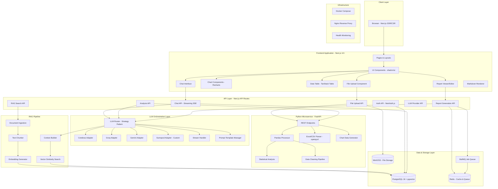

---

## Recommended Tech Stack with Justification

### Frontend

| Technology | Alasan Dipilih | Alternatif |
|-----------|----------------|------------|
| **Next.js 14/15** | App Router, SSR/SSG, API Routes built-in, excellent DX | Nuxt.js, Remix, SvelteKit |
| **TypeScript** | Type safety, better DX, catch bugs early | JavaScript (plain) |
| **Tailwind CSS** | Utility-first, rapid UI development, consistent styling | Styled Components, CSS Modules |
| **shadcn/ui** | Beautiful, accessible, copy-paste components (not a dependency) | Radix UI, Chakra UI, MUI |
| **Recharts** | React-native charts, declarative, good docs, customizable | Chart.js, Nivo, Victory |
| **TanStack Table** | Headless table, sorting/filtering/pagination built-in | AG Grid, React Table v7 |
| **react-markdown** | Render AI markdown responses safely | marked + DOMPurify |
| **Zustand** | Lightweight state management, simple API | Redux Toolkit, Jotai |

### Backend

| Technology | Alasan Dipilih | Alternatif |
|-----------|----------------|------------|
| **Next.js API Routes** | Same deployment, no CORS issues, type sharing | Express.js, Fastify |
| **Python FastAPI** | Best for data science (pandas ecosystem), async, fast | Flask, Django |
| **Prisma ORM** | Type-safe DB access, migrations, great DX | Drizzle ORM, TypeORM |
| **NextAuth.js** | Easy auth with multiple providers, session management | Clerk, Auth0, Lucia |
| **WebSocket/SSE** | Real-time streaming responses from LLM | Polling (worse UX) |

### AI/ML Layer

| Technology | Alasan Dipilih | Alternatif |
|-----------|----------------|------------|
| **Vercel AI SDK** | Unified interface, streaming built-in, multi-provider | LangChain.js, raw fetch |
| **LangChain (Python)** | RAG pipeline, document processing, chain-of-thought | LlamaIndex, Haystack |
| **Cerebras SDK** | Ultra-fast inference for quick responses | - |
| **Groq SDK** | Very low latency, good for interactive chat | - |
| **Google Generative AI** | Multimodal (bisa baca gambar), powerful | - |
| **Sumopod (Custom)** | Kontrol penuh, customizable | - |

### Data Processing

| Technology | Alasan Dipilih | Alternatif |
|-----------|----------------|------------|
| **pandas** | De facto standard data manipulation, powerful | Polars (faster tapi less mature) |
| **openpyxl** | Read/write Excel files (.xlsx) | xlrd (read-only) |
| **numpy** | Numerical computing, statistics | scipy |
| **matplotlib/plotly** | Server-side chart generation jika needed | seaborn |

### Database & Storage

| Technology | Alasan Dipilih | Alternatif |
|-----------|----------------|------------|
| **PostgreSQL 16** | Reliable, feature-rich, pgvector extension | MySQL, MongoDB |
| **pgvector** | Vector search dalam PostgreSQL, no extra service | Pinecone, Weaviate, Qdrant |
| **Redis** | Caching, session store, job queue backend | Memcached (no persistence) |
| **MinIO** | S3-compatible, self-hosted file storage | AWS S3, Cloudflare R2 |
| **BullMQ** | Job queue untuk async tasks (PDF generation) | Celery (Python) |

### PDF & Report Generation

| Technology | Alasan Dipilih | Alternatif |
|-----------|----------------|------------|
| **Puppeteer** | HTML to PDF, full CSS support, accurate rendering | wkhtmltopdf |
| **@react-pdf/renderer** | Programmatic PDF creation dengan React components | PDFKit, jsPDF |

### Infrastructure

| Technology | Alasan Dipilih | Alternatif |
|-----------|----------------|------------|
| **Docker** | Consistent environment, easy deployment | Podman |
| **Docker Compose** | Multi-service orchestration locally | Kubernetes (overkill for start) |
| **Nginx** | Reverse proxy, SSL termination, load balancing | Caddy, Traefik |

---

## Data Flow Diagrams

### 1. Chat Message Flow

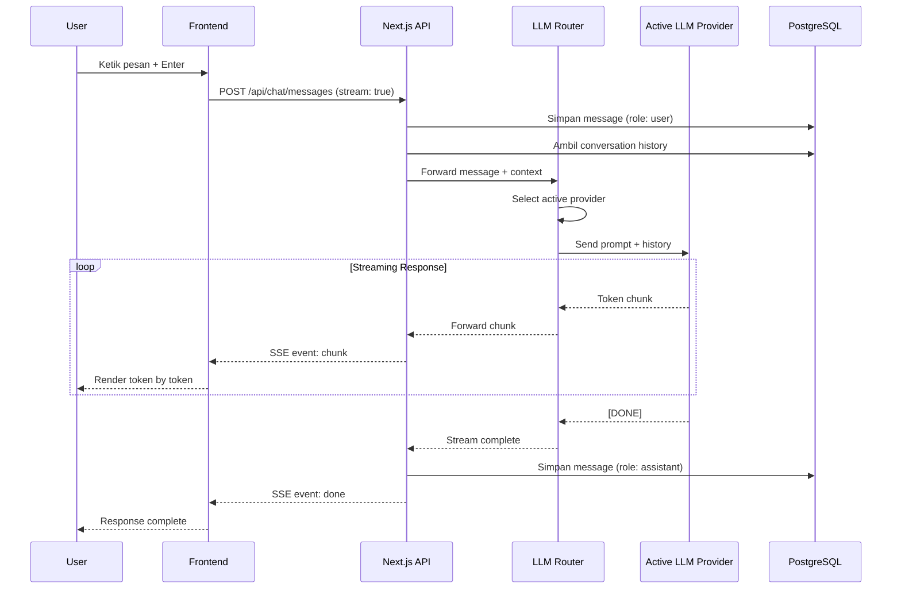

### 2. File Upload + Analysis Flow

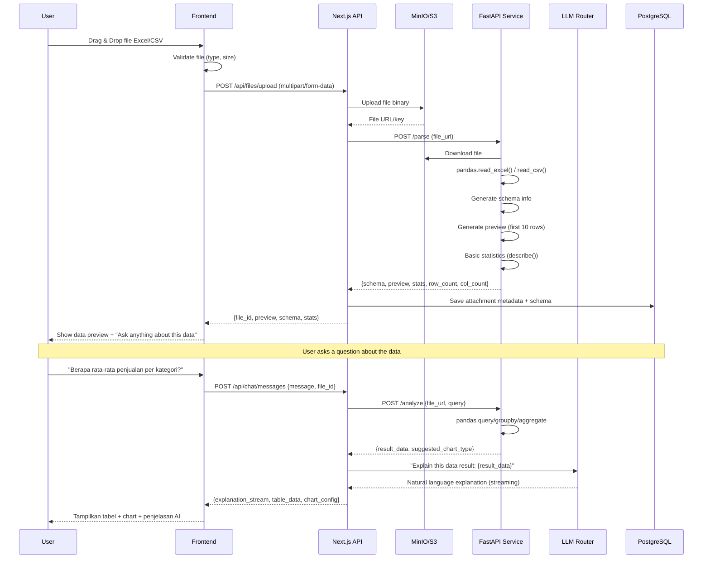

### 3. Chart Generation Flow

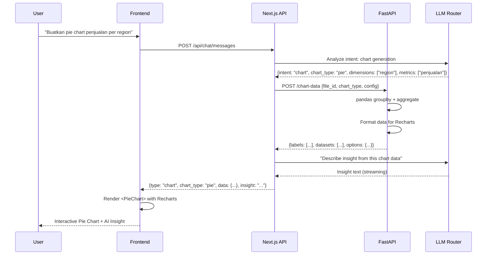

### 4. Report Generation Flow

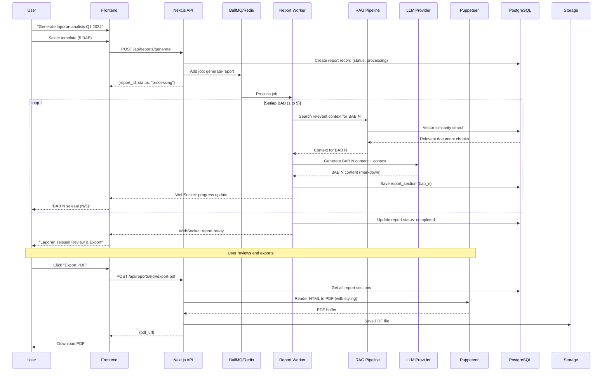

---

## Multi-LLM Provider Architecture (Adapter/Strategy Pattern)

### Pattern Design

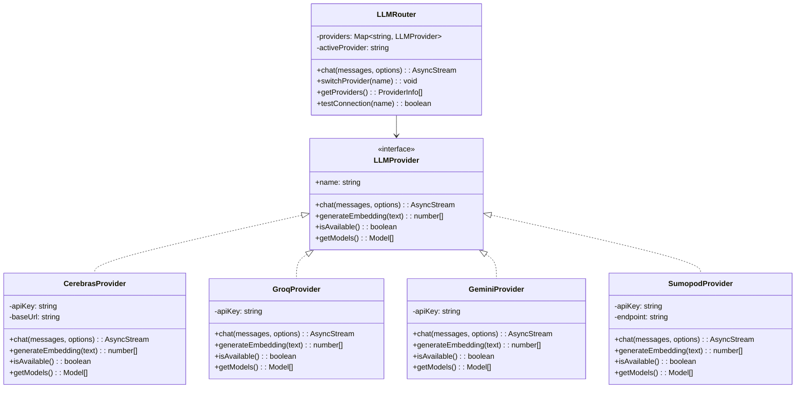

### Implementation Pattern (TypeScript)

```typescript
// Interface yang harus diimplementasi setiap provider
interface LLMProvider {
  name: string;
  
  chat(params: ChatParams): AsyncGenerator<string>;
  
  generateEmbedding(text: string): Promise<number[]>;
  
  isAvailable(): Promise<boolean>;
  
  getModels(): Model[];
}

// Router yang mengelola semua provider
class LLMRouter {
  private providers = new Map<string, LLMProvider>();
  private activeProvider: string;

  register(provider: LLMProvider) {
    this.providers.set(provider.name, provider);
  }

  async *chat(messages: Message[], options?: ChatOptions) {
    const provider = this.providers.get(this.activeProvider);
    if (!provider) throw new Error(`Provider ${this.activeProvider} not found`);
    
    yield* provider.chat({ messages, ...options });
  }

  // Fallback: jika provider gagal, coba provider lain
  async *chatWithFallback(messages: Message[], options?: ChatOptions) {
    const providerOrder = [this.activeProvider, ...this.getFallbackOrder()];
    
    for (const name of providerOrder) {
      try {
        const provider = this.providers.get(name)!;
        yield* provider.chat({ messages, ...options });
        return; // Success, stop trying
      } catch (error) {
        console.warn(`Provider ${name} failed, trying next...`);
        continue;
      }
    }
    throw new Error('All providers failed');
  }
}
```

---

## RAG Pipeline Detail

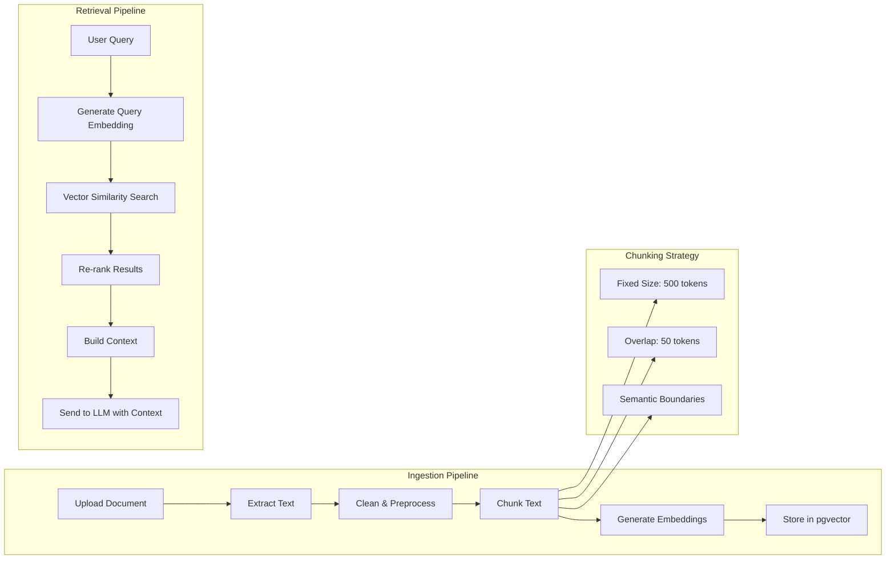

### RAG Configuration

```
Chunking Strategy:
- Chunk size: 500 tokens (optimal untuk most embedding models)
- Overlap: 50 tokens (menjaga konteks antar chunk)
- Separator: paragraph boundaries > sentence boundaries > fixed size

Embedding Model:
- Primary: text-embedding-3-small (OpenAI) atau all-MiniLM-L6-v2 (local)
- Dimension: 384 atau 1536 tergantung model
- Stored in: pgvector column type vector(384)

Retrieval:
- Top-K: 5 chunks (default)
- Similarity threshold: 0.7
- Re-ranking: Cross-encoder (optional, untuk accuracy)
- Context window: Max 4000 tokens dari retrieved chunks
```

---

## PDF Generation Pipeline

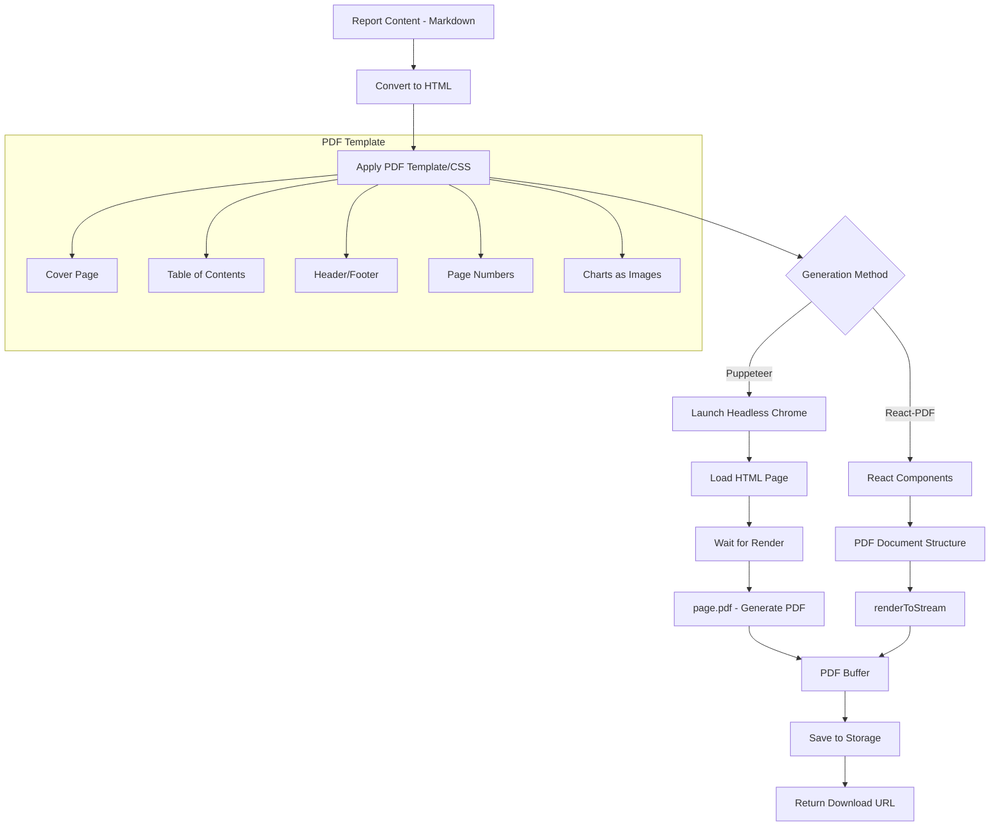

### PDF Template Structure

```
Laporan PDF Structure:
+---------------------------+
|      COVER PAGE           |
|  Judul Laporan            |
|  Tanggal, Penulis         |
+---------------------------+
|    DAFTAR ISI             |
|  BAB I ............. 1    |
|  BAB II ............ 5    |
|  BAB III ........... 12   |
+---------------------------+
|    BAB I - PENDAHULUAN    |
|  1.1 Latar Belakang       |
|  1.2 Tujuan              |
|  1.3 Ruang Lingkup       |
+---------------------------+
|    BAB II - ...           |
|  (Content with tables     |
|   and charts embedded)    |
+---------------------------+
|    ...                    |
+---------------------------+
|    LAMPIRAN               |
|  (Raw data, charts)      |
+---------------------------+
```

---

## Deployment Architecture

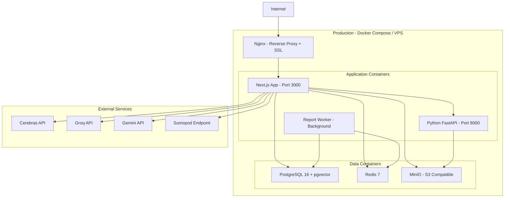

### Alternative: Vercel + Railway

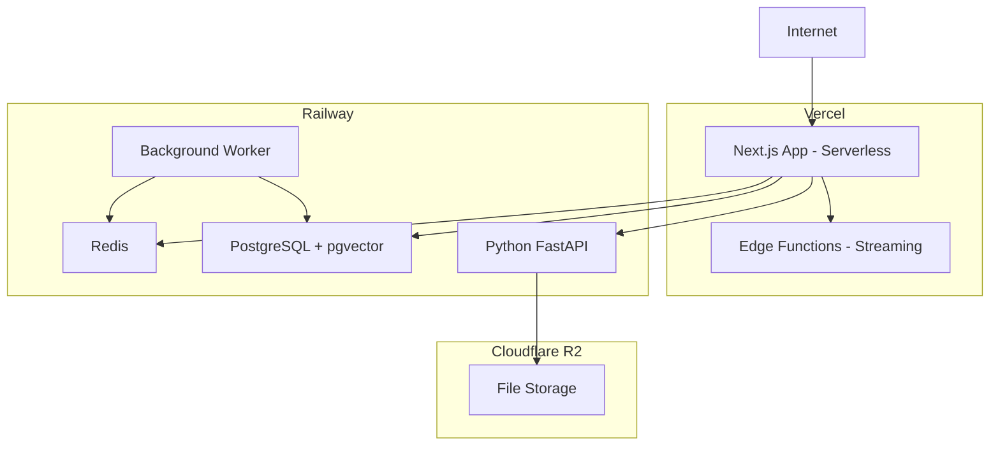

---

## Security Architecture

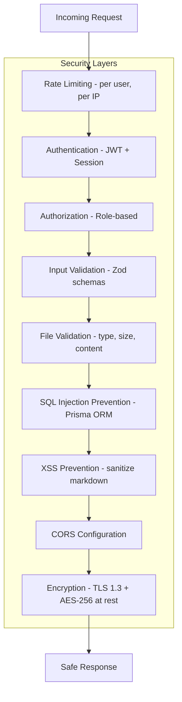
