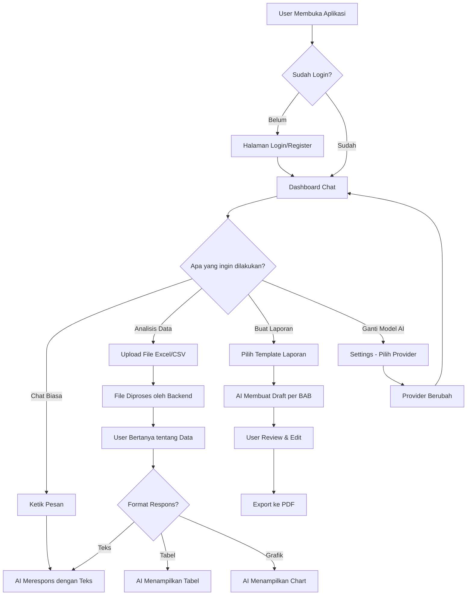
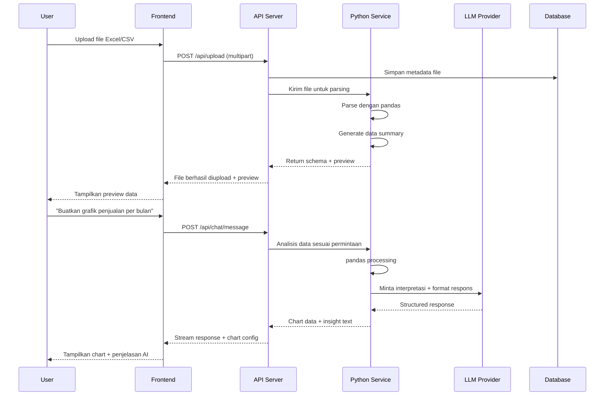
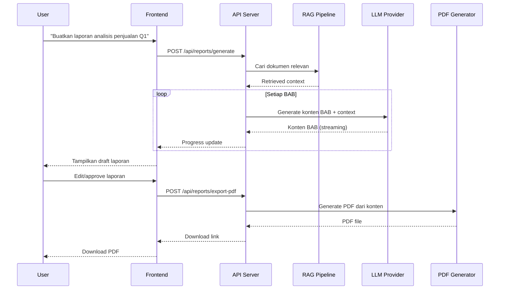
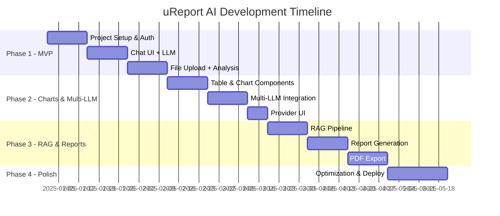

# uReport AI - Blueprint & Masterplan

## Project Overview & Vision

**uReport AI** adalah aplikasi berbasis chat yang didukung oleh AI (Artificial Intelligence) untuk melakukan analisis data, visualisasi, dan pembuatan laporan terstruktur. Aplikasi ini dirancang mirip dengan ChatGPT/Gemini/Claude, namun dikhususkan untuk:

1. **Data Analysis** - User dapat mengunggah file Excel/CSV, kemudian AI akan menganalisis dan memberikan respons berupa tabel, grafik, dan insight
2. **Multi-LLM Support** - Mendukung beberapa provider LLM: Cerebras, Groq, Gemini, dan Sumopod (custom)
3. **Report Generation** - Pembuatan laporan terstruktur dengan bab-bab (BAB I, BAB II, dst.) yang dapat diekspor ke PDF
4. **RAG (Retrieval-Augmented Generation)** - Memperkaya respons AI dengan knowledge base yang relevan

### Vision Statement

> Menjadi platform AI assistant terdepan untuk analisis data dan pembuatan laporan yang memungkinkan siapa saja - tanpa keahlian data science - untuk mendapatkan insight bermakna dari data mereka.

---

## Core Features Breakdown

### 1. Chat Interface (Antarmuka Percakapan)

```
Fitur utama berupa antarmuka chat seperti ChatGPT dimana user dapat:
- Mengirim pesan teks ke AI
- Menerima respons streaming (real-time, kata per kata)
- Melihat history percakapan sebelumnya
- Membuat percakapan baru
- Menghapus/rename percakapan
```

### 2. File Upload & Data Analysis

```
User dapat mengunggah file data untuk dianalisis:
- Format didukung: Excel (.xlsx, .xls), CSV (.csv)
- AI akan membaca dan memahami struktur data
- User bertanya tentang data dan AI menjawab dengan analisis
- Contoh: "Berapa total penjualan bulan Januari?" 
  AI: "Total penjualan Januari adalah Rp 150.000.000 berdasarkan kolom 'revenue'..."
```

### 3. Table & Chart Responses (Respons Tabel dan Grafik)

```
AI dapat merespons dalam berbagai format visual:
- Tabel data (sortable, filterable)
- Bar chart, line chart, pie chart
- Scatter plot, area chart
- Heatmap untuk korelasi data
- Summary statistics dalam format card
```

### 4. Report Generation (Pembuatan Laporan)

```
Pembuatan laporan terstruktur dengan format akademis/bisnis:
- BAB I: Pendahuluan
- BAB II: Tinjauan/Landasan
- BAB III: Metodologi/Analisis
- BAB IV: Hasil dan Pembahasan
- BAB V: Kesimpulan dan Saran
- Dapat di-custom sesuai kebutuhan user
- Export ke PDF dengan formatting profesional
```

### 5. Multi-LLM Provider

```
Mendukung beberapa provider AI:
- Cerebras: Ultra-fast inference
- Groq: Low-latency inference
- Gemini: Google's multimodal AI
- Sumopod: Custom/self-hosted model
- User dapat memilih provider sesuai kebutuhan
```

### 6. RAG (Retrieval-Augmented Generation)

```
Knowledge base untuk memperkaya respons AI:
- Upload dokumen referensi
- AI akan mencari informasi relevan dari knowledge base
- Memperkaya laporan dengan data dan referensi
- Mendukung PDF, DOCX, TXT sebagai knowledge source
```

---

## User Flow Diagrams

### Main User Flow



### File Upload & Analysis Flow



### Report Generation Flow



---

## System Architecture Overview

```mermaid
graph TB
    subgraph "Frontend - Next.js"
        UI[Chat UI + Dashboard]
        Charts[Chart Components]
        Upload[File Upload]
        PDF_View[Report Viewer]
    end
    
    subgraph "Backend - Next.js API"
        Auth[Authentication]
        Chat_API[Chat API]
        File_API[File Management]
        Report_API[Report API]
        LLM_Router[LLM Router/Orchestrator]
    end
    
    subgraph "Python Microservice"
        DataProc[Data Processing - pandas]
        ChartGen[Chart Data Generator]
        FileParser[File Parser - openpyxl]
    end
    
    subgraph "AI/LLM Layer"
        Cerebras[Cerebras API]
        Groq[Groq API]
        Gemini[Gemini API]
        Sumopod[Sumopod Custom]
    end
    
    subgraph "Data Layer"
        PG[(PostgreSQL + pgvector)]
        Redis[(Redis - Queue/Cache)]
        S3[(MinIO/S3 - File Storage)]
    end
    
    subgraph "RAG Pipeline"
        Embeddings[Text Embeddings]
        VectorSearch[Vector Search]
        Chunking[Document Chunking]
    end
    
    UI --> Chat_API
    UI --> File_API
    UI --> Report_API
    Charts --> Chat_API
    Upload --> File_API
    PDF_View --> Report_API
    
    Chat_API --> LLM_Router
    File_API --> DataProc
    Report_API --> LLM_Router
    
    LLM_Router --> Cerebras
    LLM_Router --> Groq
    LLM_Router --> Gemini
    LLM_Router --> Sumopod
    
    DataProc --> FileParser
    DataProc --> ChartGen
    
    Chat_API --> PG
    File_API --> S3
    Report_API --> Redis
    
    LLM_Router --> RAG Pipeline
    RAG Pipeline --> PG
```

---

## Phase-by-Phase Development Plan

### Phase 1: MVP - Chat + File Upload + Basic Analysis (4-6 minggu)

| Minggu | Task | Detail |
|--------|------|--------|
| 1 | Project Setup | Next.js, TypeScript, Tailwind, shadcn/ui, PostgreSQL, Prisma |
| 2 | Authentication | Login, Register, Session management |
| 2 | Chat UI | Interface chat dasar, conversation management |
| 3 | Single LLM Integration | Integrasi satu provider (Groq - paling mudah) |
| 3 | Streaming Response | Server-Sent Events untuk respons real-time |
| 4 | File Upload | Upload Excel/CSV, simpan ke storage |
| 4 | Python Service Setup | FastAPI + pandas untuk data processing |
| 5 | Basic Analysis | AI bisa membaca data dan menjawab pertanyaan |
| 6 | Testing & Bug Fix | QA, fix bugs, polish UI |

**Deliverable Phase 1:** User bisa chat dengan AI, upload file, dan mendapat analisis dasar dalam bentuk teks.

### Phase 2: Charts/Tables + Multi-LLM (4-5 minggu)

| Minggu | Task | Detail |
|--------|------|--------|
| 7 | Table Component | Tabel data interaktif (sort, filter, pagination) |
| 7 | Chart Components | Bar, Line, Pie chart menggunakan Recharts |
| 8 | AI Chart Response | AI dapat merespons dengan chart configuration |
| 9 | Multi-LLM Router | Implementasi adapter pattern untuk semua provider |
| 9 | Cerebras Integration | Integrasi Cerebras API |
| 10 | Gemini + Sumopod | Integrasi Gemini dan custom Sumopod |
| 11 | Provider Switching UI | UI untuk pilih dan switch provider |

**Deliverable Phase 2:** AI bisa merespons dengan tabel dan grafik. User bisa pilih provider LLM.

### Phase 3: RAG + Report Generation + PDF (5-6 minggu)

| Minggu | Task | Detail |
|--------|------|--------|
| 12 | RAG Pipeline Setup | pgvector, embedding model, chunking strategy |
| 13 | Document Upload | Upload dokumen ke knowledge base |
| 13 | Vector Search | Pencarian similarity untuk context retrieval |
| 14 | Report Template | Struktur BAB, template system |
| 15 | Report Generation | AI generate konten per BAB dengan RAG |
| 16 | PDF Export | Generate PDF dari laporan |
| 17 | Report Editor | UI untuk edit laporan sebelum export |

**Deliverable Phase 3:** Sistem RAG berjalan, laporan terstruktur dengan BAB bisa di-generate dan di-export ke PDF.

### Phase 4: Polish + Scale (3-4 minggu)

| Minggu | Task | Detail |
|--------|------|--------|
| 18 | Performance Optimization | Caching, lazy loading, code splitting |
| 19 | Advanced Charts | Lebih banyak tipe chart, customization |
| 19 | Error Handling | Comprehensive error handling & retry logic |
| 20 | Docker & Deployment | Containerization, CI/CD pipeline |
| 20 | Security Audit | Input validation, rate limiting, CORS |
| 21 | User Feedback & Iteration | Based on testing feedback |

**Deliverable Phase 4:** Aplikasi production-ready, teroptimasi, dan siap deploy.

### Timeline Summary



---

## Success Metrics

### Technical Metrics
| Metric | Target | Cara Ukur |
|--------|--------|-----------|
| Response Time (Chat) | < 200ms TTFB | Time to first byte streaming |
| File Processing | < 10s untuk file 10MB | End-to-end processing time |
| Chart Rendering | < 500ms | Time from data to visible chart |
| PDF Generation | < 30s per laporan | Queue processing time |
| Uptime | 99.5% | Monitoring tools |

### User Metrics
| Metric | Target | Cara Ukur |
|--------|--------|-----------|
| Successful Analysis Rate | > 90% | User mendapat jawaban yang relevan |
| Report Completion Rate | > 80% | User yang mulai buat laporan sampai export PDF |
| User Retention (Weekly) | > 60% | User kembali dalam 7 hari |
| File Upload Success | > 99% | Tidak error saat upload |

### Business Metrics
| Metric | Target | Cara Ukur |
|--------|--------|-----------|
| Active Users (Monthly) | Growth 20%/bulan | MAU tracking |
| Reports Generated | > 100/bulan per 100 users | Report count |
| Data Files Processed | > 500/bulan per 100 users | Upload count |
| LLM Cost per User | < $0.50/user/bulan | API usage tracking |

---

## Risk & Mitigation

| Risk | Impact | Mitigation |
|------|--------|------------|
| LLM API downtime | User tidak bisa chat | Multi-provider fallback |
| File terlalu besar | Server crash/timeout | File size limit + chunked processing |
| LLM hallucination | Data analysis salah | Validate AI output against actual data |
| Cost overrun (LLM API) | Biaya membengkak | Rate limiting + caching + cheaper models |
| Data privacy | Kebocoran data user | Encryption at rest + in transit, isolated storage |

---

## Out of Scope (Tidak termasuk dalam MVP)

- Mobile native app (hanya web responsive)
- Collaborative editing (multi-user pada satu dokumen)
- Custom training/fine-tuning model
- Real-time collaboration (Google Docs-like)
- Integration dengan tools lain (Slack, Teams, etc.)
- Multi-tenant/organization management

Fitur-fitur di atas bisa dipertimbangkan untuk versi future release.
