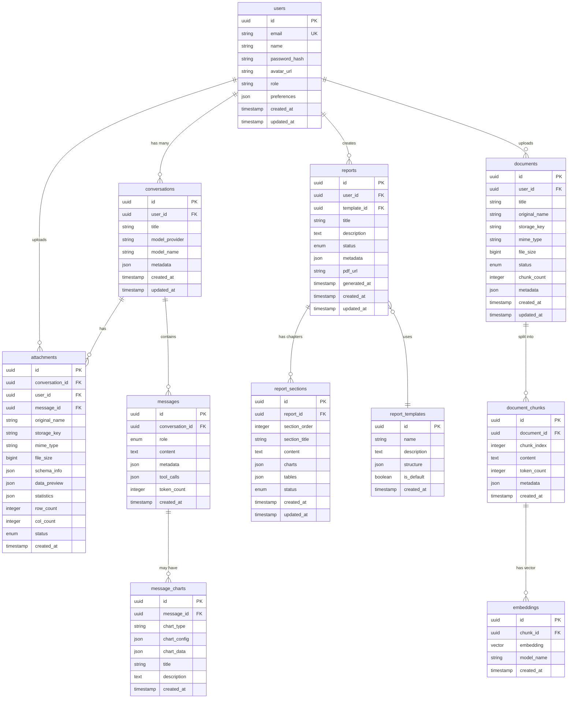

# uReport AI - Database Schema Design

## Entity-Relationship Diagram



---

## Table Definitions

### 1. `users` - Tabel User/Pengguna

Menyimpan informasi akun pengguna aplikasi.

| Column | Type | Constraints | Description |
|--------|------|-------------|-------------|
| `id` | UUID | PK, DEFAULT gen_random_uuid() | Primary key |
| `email` | VARCHAR(255) | UNIQUE, NOT NULL | Email untuk login |
| `name` | VARCHAR(255) | NOT NULL | Nama lengkap |
| `password_hash` | VARCHAR(255) | NOT NULL | Bcrypt hashed password |
| `avatar_url` | TEXT | NULLABLE | URL foto profil |
| `role` | VARCHAR(20) | DEFAULT 'user' | Role: 'user', 'admin' |
| `preferences` | JSONB | DEFAULT '{}' | Preferences (theme, default LLM provider, language) |
| `is_active` | BOOLEAN | DEFAULT true | Akun aktif atau tidak |
| `email_verified_at` | TIMESTAMP | NULLABLE | Waktu email terverifikasi |
| `created_at` | TIMESTAMP | DEFAULT NOW() | Waktu dibuat |
| `updated_at` | TIMESTAMP | DEFAULT NOW() | Waktu terakhir diupdate |

**JSONB `preferences` structure:**
```json
{
  "theme": "dark",
  "default_provider": "groq",
  "default_model": "llama-3.1-70b",
  "language": "id",
  "chart_theme": "default"
}
```

---

### 2. `conversations` - Tabel Percakapan

Menyimpan setiap sesi percakapan antara user dan AI.

| Column | Type | Constraints | Description |
|--------|------|-------------|-------------|
| `id` | UUID | PK | Primary key |
| `user_id` | UUID | FK -> users.id, NOT NULL | Pemilik percakapan |
| `title` | VARCHAR(255) | DEFAULT 'New Chat' | Judul percakapan (auto-generated dari pesan pertama) |
| `model_provider` | VARCHAR(50) | NULLABLE | Provider yang digunakan (groq, cerebras, gemini, sumopod) |
| `model_name` | VARCHAR(100) | NULLABLE | Nama model spesifik |
| `metadata` | JSONB | DEFAULT '{}' | Metadata tambahan |
| `is_archived` | BOOLEAN | DEFAULT false | Apakah di-archive |
| `created_at` | TIMESTAMP | DEFAULT NOW() | Waktu dibuat |
| `updated_at` | TIMESTAMP | DEFAULT NOW() | Waktu terakhir diupdate |

---

### 3. `messages` - Tabel Pesan

Menyimpan setiap pesan dalam percakapan (baik dari user maupun AI).

| Column | Type | Constraints | Description |
|--------|------|-------------|-------------|
| `id` | UUID | PK | Primary key |
| `conversation_id` | UUID | FK -> conversations.id, NOT NULL | Percakapan terkait |
| `role` | VARCHAR(20) | NOT NULL | 'user', 'assistant', 'system' |
| `content` | TEXT | NOT NULL | Isi pesan (markdown supported) |
| `metadata` | JSONB | DEFAULT '{}' | Info tambahan (model used, latency, etc.) |
| `tool_calls` | JSONB | NULLABLE | Tool calls yang dilakukan AI |
| `token_count` | INTEGER | NULLABLE | Jumlah token (untuk tracking usage) |
| `parent_message_id` | UUID | FK -> messages.id, NULLABLE | Untuk branching/regenerate |
| `created_at` | TIMESTAMP | DEFAULT NOW() | Waktu dibuat |

**JSONB `metadata` structure (untuk assistant messages):**
```json
{
  "model": "llama-3.1-70b",
  "provider": "groq",
  "latency_ms": 1250,
  "input_tokens": 150,
  "output_tokens": 320,
  "has_chart": true,
  "has_table": true,
  "finish_reason": "stop"
}
```

---

### 4. `attachments` - Tabel File yang Diupload

Menyimpan informasi file Excel/CSV yang diupload user untuk analisis.

| Column | Type | Constraints | Description |
|--------|------|-------------|-------------|
| `id` | UUID | PK | Primary key |
| `conversation_id` | UUID | FK -> conversations.id, NOT NULL | Percakapan terkait |
| `user_id` | UUID | FK -> users.id, NOT NULL | Pemilik file |
| `message_id` | UUID | FK -> messages.id, NULLABLE | Pesan yang mengirim file |
| `original_name` | VARCHAR(255) | NOT NULL | Nama file asli |
| `storage_key` | VARCHAR(500) | NOT NULL | Key di MinIO/S3 |
| `mime_type` | VARCHAR(100) | NOT NULL | MIME type file |
| `file_size` | BIGINT | NOT NULL | Ukuran file dalam bytes |
| `schema_info` | JSONB | NULLABLE | Informasi kolom dan tipe data |
| `data_preview` | JSONB | NULLABLE | 10 baris pertama data |
| `statistics` | JSONB | NULLABLE | Hasil pandas describe() |
| `row_count` | INTEGER | NULLABLE | Jumlah baris |
| `col_count` | INTEGER | NULLABLE | Jumlah kolom |
| `status` | VARCHAR(20) | DEFAULT 'processing' | 'processing', 'ready', 'error' |
| `error_message` | TEXT | NULLABLE | Pesan error jika gagal parse |
| `created_at` | TIMESTAMP | DEFAULT NOW() | Waktu dibuat |

**JSONB `schema_info` structure:**
```json
{
  "columns": [
    {"name": "tanggal", "type": "datetime64", "nullable": false, "sample": "2024-01-15"},
    {"name": "produk", "type": "object", "nullable": false, "sample": "Widget A"},
    {"name": "jumlah", "type": "int64", "nullable": false, "sample": 150},
    {"name": "harga", "type": "float64", "nullable": true, "sample": 25000.0}
  ],
  "sheet_names": ["Sheet1", "Sheet2"],
  "active_sheet": "Sheet1"
}
```

---

### 5. `message_charts` - Tabel Chart/Grafik dalam Pesan

Menyimpan konfigurasi chart yang di-generate AI sebagai respons.

| Column | Type | Constraints | Description |
|--------|------|-------------|-------------|
| `id` | UUID | PK | Primary key |
| `message_id` | UUID | FK -> messages.id, NOT NULL | Pesan yang mengandung chart |
| `chart_type` | VARCHAR(50) | NOT NULL | 'bar', 'line', 'pie', 'scatter', 'area', 'heatmap' |
| `chart_config` | JSONB | NOT NULL | Recharts configuration object |
| `chart_data` | JSONB | NOT NULL | Data untuk chart |
| `title` | VARCHAR(255) | NULLABLE | Judul chart |
| `description` | TEXT | NULLABLE | Penjelasan AI tentang chart |
| `created_at` | TIMESTAMP | DEFAULT NOW() | Waktu dibuat |

**JSONB `chart_config` example:**
```json
{
  "xAxis": {"dataKey": "bulan", "label": "Bulan"},
  "yAxis": {"label": "Penjualan (Juta Rp)"},
  "colors": ["#8884d8", "#82ca9d", "#ffc658"],
  "legend": true,
  "tooltip": true,
  "responsive": true
}
```

**JSONB `chart_data` example:**
```json
[
  {"bulan": "Jan", "penjualan": 150, "target": 120},
  {"bulan": "Feb", "penjualan": 180, "target": 140},
  {"bulan": "Mar", "penjualan": 200, "target": 160}
]
```

---

### 6. `reports` - Tabel Laporan

Menyimpan laporan yang di-generate oleh AI.

| Column | Type | Constraints | Description |
|--------|------|-------------|-------------|
| `id` | UUID | PK | Primary key |
| `user_id` | UUID | FK -> users.id, NOT NULL | Pembuat laporan |
| `template_id` | UUID | FK -> report_templates.id, NULLABLE | Template yang digunakan |
| `title` | VARCHAR(500) | NOT NULL | Judul laporan |
| `description` | TEXT | NULLABLE | Deskripsi singkat |
| `status` | VARCHAR(20) | DEFAULT 'draft' | 'draft', 'generating', 'completed', 'error' |
| `metadata` | JSONB | DEFAULT '{}' | Metadata (source files, provider used, etc.) |
| `pdf_url` | VARCHAR(500) | NULLABLE | URL file PDF yang sudah di-generate |
| `total_tokens` | INTEGER | DEFAULT 0 | Total token yang digunakan |
| `generated_at` | TIMESTAMP | NULLABLE | Waktu selesai generate |
| `created_at` | TIMESTAMP | DEFAULT NOW() | Waktu dibuat |
| `updated_at` | TIMESTAMP | DEFAULT NOW() | Waktu terakhir diupdate |

---

### 7. `report_sections` - Tabel Bagian/BAB Laporan

Menyimpan konten setiap BAB dalam laporan.

| Column | Type | Constraints | Description |
|--------|------|-------------|-------------|
| `id` | UUID | PK | Primary key |
| `report_id` | UUID | FK -> reports.id, NOT NULL | Laporan terkait |
| `section_order` | INTEGER | NOT NULL | Urutan BAB (1, 2, 3, ...) |
| `section_title` | VARCHAR(255) | NOT NULL | Judul BAB (e.g., "BAB I - Pendahuluan") |
| `content` | TEXT | NOT NULL | Konten dalam format Markdown |
| `charts` | JSONB | DEFAULT '[]' | Charts yang embedded dalam BAB |
| `tables` | JSONB | DEFAULT '[]' | Tables yang embedded dalam BAB |
| `word_count` | INTEGER | DEFAULT 0 | Jumlah kata |
| `status` | VARCHAR(20) | DEFAULT 'pending' | 'pending', 'generating', 'completed', 'error' |
| `created_at` | TIMESTAMP | DEFAULT NOW() | Waktu dibuat |
| `updated_at` | TIMESTAMP | DEFAULT NOW() | Waktu terakhir diupdate |

---

### 8. `report_templates` - Tabel Template Laporan

Menyimpan template struktur laporan yang tersedia.

| Column | Type | Constraints | Description |
|--------|------|-------------|-------------|
| `id` | UUID | PK | Primary key |
| `name` | VARCHAR(255) | NOT NULL | Nama template |
| `description` | TEXT | NULLABLE | Deskripsi template |
| `structure` | JSONB | NOT NULL | Struktur BAB dan sub-BAB |
| `is_default` | BOOLEAN | DEFAULT false | Template default |
| `category` | VARCHAR(50) | DEFAULT 'general' | 'academic', 'business', 'research', 'general' |
| `created_at` | TIMESTAMP | DEFAULT NOW() | Waktu dibuat |

**JSONB `structure` example:**
```json
{
  "sections": [
    {
      "order": 1,
      "title": "BAB I - Pendahuluan",
      "subsections": ["Latar Belakang", "Tujuan", "Ruang Lingkup"],
      "prompt_hint": "Tulis pendahuluan yang menjelaskan konteks dan tujuan analisis"
    },
    {
      "order": 2,
      "title": "BAB II - Tinjauan Pustaka",
      "subsections": ["Landasan Teori", "Penelitian Terdahulu"],
      "prompt_hint": "Gunakan RAG untuk mengambil referensi yang relevan"
    },
    {
      "order": 3,
      "title": "BAB III - Metodologi",
      "subsections": ["Sumber Data", "Metode Analisis", "Tools yang Digunakan"],
      "prompt_hint": "Jelaskan metode analisis data yang dilakukan"
    },
    {
      "order": 4,
      "title": "BAB IV - Hasil dan Pembahasan",
      "subsections": ["Hasil Analisis", "Visualisasi Data", "Interpretasi"],
      "prompt_hint": "Sertakan hasil analisis dengan tabel dan grafik"
    },
    {
      "order": 5,
      "title": "BAB V - Kesimpulan dan Saran",
      "subsections": ["Kesimpulan", "Saran", "Keterbatasan"],
      "prompt_hint": "Rangkum temuan utama dan berikan rekomendasi"
    }
  ]
}
```

---

### 9. `documents` - Tabel Dokumen Knowledge Base (RAG)

Menyimpan dokumen yang diupload untuk knowledge base RAG.

| Column | Type | Constraints | Description |
|--------|------|-------------|-------------|
| `id` | UUID | PK | Primary key |
| `user_id` | UUID | FK -> users.id, NOT NULL | Pemilik dokumen |
| `title` | VARCHAR(255) | NOT NULL | Judul dokumen |
| `original_name` | VARCHAR(255) | NOT NULL | Nama file asli |
| `storage_key` | VARCHAR(500) | NOT NULL | Key di storage |
| `mime_type` | VARCHAR(100) | NOT NULL | MIME type |
| `file_size` | BIGINT | NOT NULL | Ukuran file |
| `status` | VARCHAR(20) | DEFAULT 'processing' | 'processing', 'indexed', 'error' |
| `chunk_count` | INTEGER | DEFAULT 0 | Jumlah chunks yang dihasilkan |
| `metadata` | JSONB | DEFAULT '{}' | Metadata (author, date, category, etc.) |
| `error_message` | TEXT | NULLABLE | Error message jika gagal |
| `created_at` | TIMESTAMP | DEFAULT NOW() | Waktu dibuat |
| `updated_at` | TIMESTAMP | DEFAULT NOW() | Waktu terakhir diupdate |

---

### 10. `document_chunks` - Tabel Potongan Dokumen

Menyimpan hasil chunking dokumen untuk RAG.

| Column | Type | Constraints | Description |
|--------|------|-------------|-------------|
| `id` | UUID | PK | Primary key |
| `document_id` | UUID | FK -> documents.id, NOT NULL | Dokumen asal |
| `chunk_index` | INTEGER | NOT NULL | Urutan chunk (0-based) |
| `content` | TEXT | NOT NULL | Isi chunk teks |
| `token_count` | INTEGER | NOT NULL | Jumlah token dalam chunk |
| `metadata` | JSONB | DEFAULT '{}' | Metadata (page number, heading, etc.) |
| `created_at` | TIMESTAMP | DEFAULT NOW() | Waktu dibuat |

---

### 11. `embeddings` - Tabel Vector Embeddings

Menyimpan vector embeddings untuk similarity search (RAG).

| Column | Type | Constraints | Description |
|--------|------|-------------|-------------|
| `id` | UUID | PK | Primary key |
| `chunk_id` | UUID | FK -> document_chunks.id, NOT NULL | Chunk terkait |
| `embedding` | VECTOR(384) | NOT NULL | Vector embedding (dimensi tergantung model) |
| `model_name` | VARCHAR(100) | NOT NULL | Nama embedding model yang digunakan |
| `created_at` | TIMESTAMP | DEFAULT NOW() | Waktu dibuat |

> **Note:** Dimensi vector bisa 384 (all-MiniLM-L6-v2) atau 1536 (text-embedding-3-small). Pilih sesuai model yang dipakai.

---

## Relationships Explained

### Relasi Utama

```
users (1) -----> (N) conversations
  Satu user memiliki banyak percakapan

conversations (1) -----> (N) messages
  Satu percakapan memiliki banyak pesan

conversations (1) -----> (N) attachments
  Satu percakapan bisa punya banyak file attachment

messages (1) -----> (N) message_charts
  Satu pesan AI bisa mengandung beberapa chart

users (1) -----> (N) reports
  Satu user bisa membuat banyak laporan

reports (1) -----> (N) report_sections
  Satu laporan memiliki banyak sections/BAB

reports (N) -----> (1) report_templates
  Banyak laporan bisa menggunakan satu template

users (1) -----> (N) documents
  Satu user bisa upload banyak dokumen untuk RAG

documents (1) -----> (N) document_chunks
  Satu dokumen dipecah menjadi banyak chunks

document_chunks (1) -----> (1) embeddings
  Setiap chunk memiliki satu vector embedding
```

### Cascade Delete Rules

| Parent | Child | On Delete |
|--------|-------|-----------|
| users | conversations | CASCADE |
| users | reports | CASCADE |
| users | documents | CASCADE |
| conversations | messages | CASCADE |
| conversations | attachments | CASCADE |
| messages | message_charts | CASCADE |
| reports | report_sections | CASCADE |
| documents | document_chunks | CASCADE |
| document_chunks | embeddings | CASCADE |

---

## Index Strategy

### Primary Indexes (Otomatis dari PK)
- Semua kolom `id` sudah terindex sebagai Primary Key

### Performance Indexes

```sql
-- Users
CREATE UNIQUE INDEX idx_users_email ON users(email);

-- Conversations
CREATE INDEX idx_conversations_user_id ON conversations(user_id);
CREATE INDEX idx_conversations_user_updated ON conversations(user_id, updated_at DESC);

-- Messages
CREATE INDEX idx_messages_conversation_id ON messages(conversation_id);
CREATE INDEX idx_messages_conversation_created ON messages(conversation_id, created_at ASC);

-- Attachments
CREATE INDEX idx_attachments_conversation_id ON attachments(conversation_id);
CREATE INDEX idx_attachments_user_id ON attachments(user_id);
CREATE INDEX idx_attachments_status ON attachments(status) WHERE status = 'processing';

-- Message Charts
CREATE INDEX idx_message_charts_message_id ON message_charts(message_id);

-- Reports
CREATE INDEX idx_reports_user_id ON reports(user_id);
CREATE INDEX idx_reports_status ON reports(status);
CREATE INDEX idx_reports_user_created ON reports(user_id, created_at DESC);

-- Report Sections
CREATE INDEX idx_report_sections_report_id ON report_sections(report_id);
CREATE INDEX idx_report_sections_order ON report_sections(report_id, section_order);

-- Documents (RAG)
CREATE INDEX idx_documents_user_id ON documents(user_id);
CREATE INDEX idx_documents_status ON documents(status);

-- Document Chunks
CREATE INDEX idx_document_chunks_document_id ON document_chunks(document_id);
CREATE INDEX idx_document_chunks_order ON document_chunks(document_id, chunk_index);

-- Embeddings - Vector Index (untuk similarity search)
CREATE INDEX idx_embeddings_chunk_id ON embeddings(chunk_id);
CREATE INDEX idx_embeddings_vector ON embeddings 
  USING ivfflat (embedding vector_cosine_ops) WITH (lists = 100);
-- Atau menggunakan HNSW (lebih cepat untuk read, lebih lambat untuk write):
-- CREATE INDEX idx_embeddings_vector_hnsw ON embeddings 
--   USING hnsw (embedding vector_cosine_ops) WITH (m = 16, ef_construction = 64);
```

### Index Notes

1. **ivfflat vs HNSW untuk pgvector:**
   - `ivfflat`: Cocok jika data berubah sering, build index cepat, query sedikit lebih lambat
   - `hnsw`: Cocok jika data jarang berubah, build index lambat, query sangat cepat
   - Rekomendasi: Mulai dengan `ivfflat`, migrate ke `hnsw` saat data sudah stabil

2. **Partial Indexes:**
   - `idx_attachments_status` hanya index baris dengan status 'processing' (untuk monitoring)
   - Menghemat space dan mempercepat query spesifik

3. **Composite Indexes:**
   - `idx_conversations_user_updated`: Untuk query "percakapan terbaru milik user X"
   - `idx_messages_conversation_created`: Untuk query "semua pesan dalam urutan waktu"

---

## Migration Strategy

### Prisma Schema (Simplified)

```prisma
generator client {
  provider = "prisma-client-js"
}

datasource db {
  provider = "postgresql"
  url      = env("DATABASE_URL")
}

model User {
  id              String         @id @default(uuid())
  email           String         @unique
  name            String
  passwordHash    String         @map("password_hash")
  avatarUrl       String?        @map("avatar_url")
  role            String         @default("user")
  preferences     Json           @default("{}")
  isActive        Boolean        @default(true) @map("is_active")
  emailVerifiedAt DateTime?      @map("email_verified_at")
  createdAt       DateTime       @default(now()) @map("created_at")
  updatedAt       DateTime       @updatedAt @map("updated_at")
  
  conversations   Conversation[]
  reports         Report[]
  documents       Document[]
  attachments     Attachment[]

  @@map("users")
}

model Conversation {
  id            String       @id @default(uuid())
  userId        String       @map("user_id")
  title         String       @default("New Chat")
  modelProvider String?      @map("model_provider")
  modelName     String?      @map("model_name")
  metadata      Json         @default("{}")
  isArchived    Boolean      @default(false) @map("is_archived")
  createdAt     DateTime     @default(now()) @map("created_at")
  updatedAt     DateTime     @updatedAt @map("updated_at")
  
  user          User         @relation(fields: [userId], references: [id], onDelete: Cascade)
  messages      Message[]
  attachments   Attachment[]

  @@index([userId, updatedAt(sort: Desc)])
  @@map("conversations")
}

model Message {
  id              String         @id @default(uuid())
  conversationId  String         @map("conversation_id")
  role            String
  content         String
  metadata        Json           @default("{}")
  toolCalls       Json?          @map("tool_calls")
  tokenCount      Int?           @map("token_count")
  parentMessageId String?        @map("parent_message_id")
  createdAt       DateTime       @default(now()) @map("created_at")
  
  conversation    Conversation   @relation(fields: [conversationId], references: [id], onDelete: Cascade)
  parent          Message?       @relation("MessageThread", fields: [parentMessageId], references: [id])
  replies         Message[]      @relation("MessageThread")
  charts          MessageChart[]

  @@index([conversationId, createdAt(sort: Asc)])
  @@map("messages")
}

// ... (tabel lainnya mengikuti pola yang sama)
```

---

## Data Volume Estimates

Estimasi untuk perencanaan kapasitas (per 1000 active users):

| Table | Rows/month | Avg Row Size | Monthly Growth |
|-------|-----------|--------------|----------------|
| messages | 500,000 | 2 KB | ~1 GB |
| document_chunks | 100,000 | 1 KB | ~100 MB |
| embeddings | 100,000 | 1.5 KB (384 dim) | ~150 MB |
| attachments | 10,000 | 0.5 KB (metadata only) | ~5 MB |
| message_charts | 50,000 | 5 KB | ~250 MB |
| report_sections | 5,000 | 10 KB | ~50 MB |

**Total estimated DB growth: ~1.5 GB/month per 1000 active users**

File storage (MinIO/S3) terpisah:
- Excel/CSV files: ~500 MB/month per 1000 users
- PDF reports: ~200 MB/month per 1000 users
- RAG documents: ~1 GB/month per 1000 users
