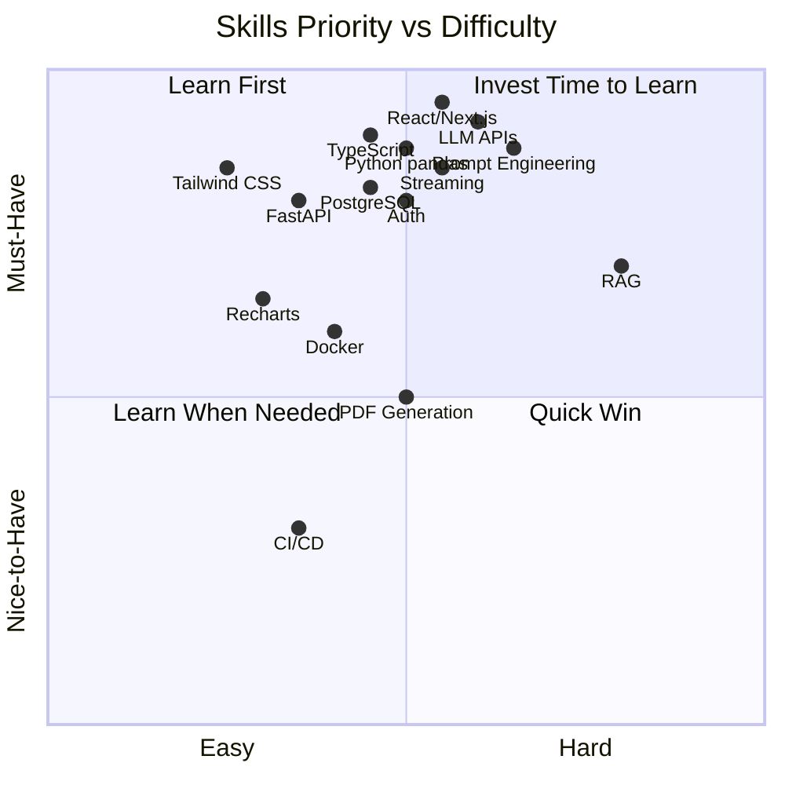

# uReport AI - Skills & Knowledge Required

## Overview

Dokumen ini berisi daftar semua skills dan pengetahuan yang dibutuhkan untuk membangun uReport AI. Setiap skill dikategorikan berdasarkan:
- **Difficulty Level:** Beginner / Intermediate / Advanced
- **Priority:** Must-Have / Important / Nice-to-Have
- **Time to Learn:** Estimasi waktu untuk menguasai dasar

---

## 1. Frontend Development

### 1.1 React Fundamentals

| Aspek | Detail |
|-------|--------|
| **Difficulty** | Intermediate |
| **Priority** | Must-Have |
| **Time to Learn** | 2-4 minggu |

**Yang perlu dikuasai:**
- JSX syntax dan component structure
- useState, useEffect, useRef, useCallback, useMemo hooks
- Component lifecycle
- Props dan state management
- Event handling
- Conditional rendering dan list rendering
- Custom hooks
- Context API (basic)
- Error boundaries

**Learning Resources:**
- [React Official Docs](https://react.dev/) - New React docs (sangat bagus)
- [React Tutorial (Tic-Tac-Toe)](https://react.dev/learn/tutorial-tic-tac-toe) - Hands-on
- [Full React Course - freeCodeCamp](https://www.youtube.com/watch?v=bMknfKXIFA8) - Video 12 jam
- [React Patterns](https://reactpatterns.com/) - Common patterns

---

### 1.2 Next.js (App Router)

| Aspek | Detail |
|-------|--------|
| **Difficulty** | Intermediate |
| **Priority** | Must-Have |
| **Time to Learn** | 2-3 minggu |

**Yang perlu dikuasai:**
- File-based routing (pages, layouts, loading, error)
- Server Components vs Client Components
- Data fetching (server-side)
- API Route Handlers (GET, POST, PUT, DELETE)
- Middleware
- Dynamic routes dan route groups
- Server Actions
- Streaming dan Suspense
- Image optimization
- Environment variables

**Learning Resources:**
- [Next.js Learn Course](https://nextjs.org/learn) - Official interactive course
- [Next.js Docs - App Router](https://nextjs.org/docs/app) - Reference
- [Lee Robinson YouTube](https://www.youtube.com/@laboris) - Next.js creator's channel

---

### 1.3 TypeScript

| Aspek | Detail |
|-------|--------|
| **Difficulty** | Intermediate |
| **Priority** | Must-Have |
| **Time to Learn** | 2-3 minggu |

**Yang perlu dikuasai:**
- Basic types (string, number, boolean, array, object)
- Interfaces dan type aliases
- Generic types
- Union types dan intersection types
- Type narrowing dan type guards
- Utility types (Partial, Omit, Pick, Record)
- Enums
- Type inference
- Module types dan declaration files
- Async types (Promise<T>)

**Learning Resources:**
- [TypeScript Handbook](https://www.typescriptlang.org/docs/handbook/) - Official
- [TypeScript Exercises](https://typescript-exercises.github.io/) - Practice
- [Type Challenges](https://github.com/type-challenges/type-challenges) - Advanced practice

---

### 1.4 CSS & Tailwind CSS

| Aspek | Detail |
|-------|--------|
| **Difficulty** | Beginner-Intermediate |
| **Priority** | Must-Have |
| **Time to Learn** | 1-2 minggu |

**Yang perlu dikuasai:**
- CSS fundamentals (box model, flexbox, grid)
- Responsive design (media queries, mobile-first)
- Tailwind utility classes
- Tailwind configuration (theme, colors, spacing)
- Dark mode implementation
- CSS animations (transition, transform)
- Tailwind plugins

**Learning Resources:**
- [Tailwind CSS Docs](https://tailwindcss.com/docs) - Official docs (sangat lengkap)
- [Flexbox Froggy](https://flexboxfroggy.com/) - Game belajar flexbox
- [Grid Garden](https://cssgridgarden.com/) - Game belajar CSS grid
- [Tailwind Labs YouTube](https://www.youtube.com/@TailwindLabs) - Video tutorials

---

### 1.5 Component Libraries (shadcn/ui)

| Aspek | Detail |
|-------|--------|
| **Difficulty** | Beginner |
| **Priority** | Important |
| **Time to Learn** | 1 minggu |

**Yang perlu dikuasai:**
- Cara install dan menggunakan shadcn/ui components
- Customizing components (styling, variants)
- Accessibility patterns (keyboard navigation, screen readers)
- Common UI patterns (Dialog, Sheet, Dropdown, Toast)
- Form handling dengan React Hook Form + Zod

**Learning Resources:**
- [shadcn/ui Documentation](https://ui.shadcn.com/docs) - Docs dan examples
- [Radix UI Primitives](https://www.radix-ui.com/primitives) - Underlying primitives

---

### 1.6 Data Visualization (Recharts)

| Aspek | Detail |
|-------|--------|
| **Difficulty** | Intermediate |
| **Priority** | Important |
| **Time to Learn** | 1-2 minggu |

**Yang perlu dikuasai:**
- Recharts component API (BarChart, LineChart, PieChart, etc.)
- Data formatting untuk charts
- Customizing tooltips, legends, axes
- Responsive containers
- Animated transitions
- Multiple chart types dalam satu view
- Event handling (click, hover)

**Learning Resources:**
- [Recharts Examples Gallery](https://recharts.org/en-US/examples) - Visual examples
- [Recharts API Reference](https://recharts.org/en-US/api) - Component reference

---

## 2. Backend Development

### 2.1 Node.js & Runtime Concepts

| Aspek | Detail |
|-------|--------|
| **Difficulty** | Intermediate |
| **Priority** | Must-Have |
| **Time to Learn** | 2-3 minggu |

**Yang perlu dikuasai:**
- Event loop dan async programming
- Streams (ReadableStream, WritableStream)
- Buffer dan binary data handling
- File system operations
- Environment variables
- Error handling patterns
- Package management (npm/bun)

**Learning Resources:**
- [Node.js Docs](https://nodejs.org/docs/latest/api/) - Official API docs
- [Node.js Best Practices](https://github.com/goldbergyoni/nodebestpractices) - 80+ best practices

---

### 2.2 Python (for Data Processing)

| Aspek | Detail |
|-------|--------|
| **Difficulty** | Beginner-Intermediate |
| **Priority** | Must-Have |
| **Time to Learn** | 3-4 minggu (jika dari nol) |

**Yang perlu dikuasai:**
- Python syntax fundamentals
- Data structures (list, dict, tuple, set)
- File I/O
- Error handling (try/except)
- Virtual environments (venv/poetry)
- Type hints
- Async/await (asyncio)
- List comprehensions
- Object-oriented programming basics

**Learning Resources:**
- [Python Official Tutorial](https://docs.python.org/3/tutorial/) - Official
- [Automate the Boring Stuff](https://automatetheboringstuff.com/) - Free book
- [Real Python](https://realpython.com/) - Tutorials dan articles
- [Python for Everybody](https://www.py4e.com/) - Free course

---

### 2.3 REST API Design

| Aspek | Detail |
|-------|--------|
| **Difficulty** | Intermediate |
| **Priority** | Must-Have |
| **Time to Learn** | 1-2 minggu |

**Yang perlu dikuasai:**
- HTTP methods (GET, POST, PUT, PATCH, DELETE)
- Status codes (200, 201, 400, 401, 403, 404, 500)
- Request/response body structure
- Query parameters vs path parameters
- Headers (Authorization, Content-Type, etc.)
- Error response format
- Pagination patterns
- Versioning strategies
- Rate limiting concepts

**Learning Resources:**
- [REST API Design Best Practices](https://restfulapi.net/) - Comprehensive guide
- [HTTP Status Codes](https://httpstatuses.com/) - Reference
- [API Design Patterns (Google)](https://cloud.google.com/apis/design) - Google's guide

---

### 2.4 WebSocket & Server-Sent Events (SSE)

| Aspek | Detail |
|-------|--------|
| **Difficulty** | Intermediate |
| **Priority** | Must-Have |
| **Time to Learn** | 1 minggu |

**Yang perlu dikuasai:**
- Perbedaan WebSocket vs SSE vs Long Polling
- Server-Sent Events implementation (untuk LLM streaming)
- ReadableStream API
- EventSource di client
- Connection handling dan reconnection
- Backpressure

**Kenapa penting:** LLM responses harus di-stream token by token agar UX bagus. SSE adalah pilihan terbaik untuk ini.

**Learning Resources:**
- [MDN - Server-Sent Events](https://developer.mozilla.org/en-US/docs/Web/API/Server-sent_events) - Reference
- [Vercel AI SDK Streaming](https://sdk.vercel.ai/docs/concepts/streaming) - Practical guide

---

### 2.5 Authentication & Authorization

| Aspek | Detail |
|-------|--------|
| **Difficulty** | Intermediate |
| **Priority** | Must-Have |
| **Time to Learn** | 1-2 minggu |

**Yang perlu dikuasai:**
- Session-based vs Token-based auth
- JWT (JSON Web Tokens) - structure, signing, verification
- OAuth 2.0 basics
- Password hashing (bcrypt)
- CSRF protection
- Rate limiting
- Role-based access control (RBAC)
- Secure cookie handling

**Learning Resources:**
- [NextAuth.js Getting Started](https://next-auth.js.org/getting-started/introduction) - Practical
- [OWASP Auth Cheatsheet](https://cheatsheetseries.owasp.org/cheatsheets/Authentication_Cheat_Sheet.html) - Security

---

## 3. AI/ML Integration

### 3.1 LLM APIs & Concepts

| Aspek | Detail |
|-------|--------|
| **Difficulty** | Intermediate |
| **Priority** | Must-Have |
| **Time to Learn** | 2-3 minggu |

**Yang perlu dikuasai:**
- Konsep LLM (tokens, context window, temperature, top-p)
- Chat completion API format (messages array: system, user, assistant)
- Streaming responses
- Token counting dan cost estimation
- Model selection (trade-off: speed vs quality vs cost)
- Error handling (rate limits, timeouts, token limits)
- Function/tool calling

**Learning Resources:**
- [OpenAI API Docs](https://platform.openai.com/docs) - De facto standard API format
- [Groq Docs](https://console.groq.com/docs) - Groq-specific
- [Vercel AI SDK Docs](https://sdk.vercel.ai/docs) - Unified interface

---

### 3.2 Prompt Engineering

| Aspek | Detail |
|-------|--------|
| **Difficulty** | Intermediate-Advanced |
| **Priority** | Must-Have |
| **Time to Learn** | 2-4 minggu (ongoing) |

**Yang perlu dikuasai:**
- System prompt design
- Few-shot prompting (memberikan contoh)
- Chain-of-thought prompting
- Output formatting (JSON, Markdown, structured)
- Prompt templates dan variables
- Context injection (RAG results into prompt)
- Guardrails dan safety prompts
- Iterative prompt refinement

**Untuk uReport AI specifically:**
- Prompt untuk data analysis: "Given this data schema: {schema}, answer: {question}"
- Prompt untuk chart generation: "Based on this data, suggest the best chart type and provide data in format: {format}"
- Prompt untuk report writing: "Write BAB {n} about {topic} using these references: {context}"

**Learning Resources:**
- [Prompt Engineering Guide](https://www.promptingguide.ai/) - Comprehensive guide
- [OpenAI Prompt Engineering](https://platform.openai.com/docs/guides/prompt-engineering) - Best practices
- [Anthropic Prompt Design](https://docs.anthropic.com/en/docs/build-with-claude/prompt-engineering/overview) - Claude's guide

---

### 3.3 RAG (Retrieval-Augmented Generation)

| Aspek | Detail |
|-------|--------|
| **Difficulty** | Advanced |
| **Priority** | Important |
| **Time to Learn** | 3-4 minggu |

**Yang perlu dikuasai:**
- Vector embeddings concepts (apa itu embedding, dimensi, similarity)
- Document chunking strategies (fixed size, semantic, recursive)
- Embedding models (OpenAI, sentence-transformers, etc.)
- Vector similarity search (cosine similarity, L2 distance)
- Retrieval strategies (top-k, threshold, hybrid search)
- Context window management
- Re-ranking techniques
- Evaluation metrics (relevance, faithfulness)

**Learning Resources:**
- [LangChain RAG Tutorial](https://python.langchain.com/docs/tutorials/rag/) - Hands-on
- [RAG from Scratch (LangChain)](https://github.com/langchain-ai/rag-from-scratch) - Video series
- [What is RAG? (IBM)](https://www.ibm.com/topics/retrieval-augmented-generation) - Concept

---

### 3.4 Streaming Responses

| Aspek | Detail |
|-------|--------|
| **Difficulty** | Intermediate |
| **Priority** | Must-Have |
| **Time to Learn** | 1 minggu |

**Yang perlu dikuasai:**
- Server-Sent Events (SSE) protocol
- ReadableStream dan TransformStream
- Token-by-token rendering
- Error handling dalam stream
- Abort/cancel stream
- Progress indication

**Learning Resources:**
- [Vercel AI SDK - Streaming](https://sdk.vercel.ai/docs/ai-sdk-ui/streaming) - Practical
- [MDN ReadableStream](https://developer.mozilla.org/en-US/docs/Web/API/ReadableStream) - Reference

---

## 4. Data Engineering

### 4.1 pandas & Data Manipulation

| Aspek | Detail |
|-------|--------|
| **Difficulty** | Intermediate |
| **Priority** | Must-Have |
| **Time to Learn** | 3-4 minggu |

**Yang perlu dikuasai:**
- DataFrame creation dan manipulation
- Reading files: read_excel(), read_csv()
- Data selection: loc, iloc, boolean indexing
- GroupBy operations
- Aggregation functions (sum, mean, count, etc.)
- Pivot tables
- Merge/join DataFrames
- Data cleaning (missing values, duplicates, type conversion)
- describe() untuk summary statistics
- Data export (to_json, to_dict)

**Learning Resources:**
- [pandas Getting Started](https://pandas.pydata.org/docs/getting_started/index.html) - Official
- [Kaggle - pandas Course](https://www.kaggle.com/learn/pandas) - Free interactive course
- [pandas Cheat Sheet](https://pandas.pydata.org/Pandas_Cheat_Sheet.pdf) - Quick reference

---

### 4.2 Data Cleaning & Preparation

| Aspek | Detail |
|-------|--------|
| **Difficulty** | Intermediate |
| **Priority** | Important |
| **Time to Learn** | 2 minggu |

**Yang perlu dikuasai:**
- Handling missing data (dropna, fillna, interpolate)
- Data type conversion (to_numeric, to_datetime)
- String operations (str accessor)
- Outlier detection
- Data normalization/standardization
- Column renaming dan reordering
- Handling duplicates
- Date/time parsing

---

### 4.3 Statistical Analysis Basics

| Aspek | Detail |
|-------|--------|
| **Difficulty** | Intermediate |
| **Priority** | Important |
| **Time to Learn** | 2-3 minggu |

**Yang perlu dikuasai:**
- Descriptive statistics (mean, median, mode, std, variance)
- Distribution analysis
- Correlation (Pearson, Spearman)
- Trend analysis (basic)
- Percentiles dan quartiles
- Hypothesis testing basics (optional)

**Learning Resources:**
- [Statistics with Python (Coursera)](https://www.coursera.org/specializations/statistics-with-python) - Free to audit
- [Khan Academy Statistics](https://www.khanacademy.org/math/statistics-probability) - Free

---

### 4.4 Data Visualization Concepts

| Aspek | Detail |
|-------|--------|
| **Difficulty** | Beginner-Intermediate |
| **Priority** | Important |
| **Time to Learn** | 1-2 minggu |

**Yang perlu dikuasai:**
- Kapan menggunakan chart type yang mana:
  - Bar chart: perbandingan kategori
  - Line chart: trend over time
  - Pie chart: proporsi/komposisi
  - Scatter plot: korelasi dua variabel
  - Area chart: volume over time
  - Heatmap: korelasi matrix
- Color theory untuk data viz
- Chart labeling best practices
- Accessibility dalam chart

**Learning Resources:**
- [From Data to Viz](https://www.data-to-viz.com/) - Decision tree untuk chart selection
- [Data Visualization Catalogue](https://datavizcatalogue.com/) - Chart types reference

---

## 5. DevOps & Infrastructure

### 5.1 Docker

| Aspek | Detail |
|-------|--------|
| **Difficulty** | Intermediate |
| **Priority** | Important |
| **Time to Learn** | 1-2 minggu |

**Yang perlu dikuasai:**
- Dockerfile writing (FROM, RUN, COPY, CMD, EXPOSE)
- Multi-stage builds
- Docker Compose (services, volumes, networks, environment)
- Container networking
- Volume management untuk persistent data
- Environment variables
- Docker image optimization (layer caching, .dockerignore)

**Learning Resources:**
- [Docker Get Started](https://docs.docker.com/get-started/) - Official tutorial
- [Docker Compose Docs](https://docs.docker.com/compose/) - Multi-service

---

### 5.2 CI/CD Basics

| Aspek | Detail |
|-------|--------|
| **Difficulty** | Intermediate |
| **Priority** | Nice-to-Have |
| **Time to Learn** | 1 minggu |

**Yang perlu dikuasai:**
- GitHub Actions basics
- Build-test-deploy pipeline
- Environment secrets
- Automated testing on PR
- Docker image build dan push
- Deployment triggers

**Learning Resources:**
- [GitHub Actions Docs](https://docs.github.com/en/actions) - Official
- [GitHub Actions Quickstart](https://docs.github.com/en/actions/quickstart) - 10 minute guide

---

### 5.3 Cloud Deployment

| Aspek | Detail |
|-------|--------|
| **Difficulty** | Intermediate |
| **Priority** | Important |
| **Time to Learn** | 1-2 minggu |

**Yang perlu dikuasai:**
- Option 1: Vercel (Next.js) + Railway (PostgreSQL, Redis, Python)
- Option 2: VPS + Docker Compose (DigitalOcean, Hetzner)
- Option 3: AWS/GCP (more complex)
- SSL/TLS setup
- Domain configuration (DNS)
- Monitoring basics
- Backup strategies

**Learning Resources:**
- [Vercel Deployment Docs](https://vercel.com/docs) - For Next.js
- [Railway Docs](https://docs.railway.app/) - For databases/services
- [DigitalOcean Tutorials](https://www.digitalocean.com/community/tutorials) - VPS guides

---

### 5.4 Database Management

| Aspek | Detail |
|-------|--------|
| **Difficulty** | Intermediate |
| **Priority** | Important |
| **Time to Learn** | 2 minggu |

**Yang perlu dikuasai:**
- SQL fundamentals (SELECT, INSERT, UPDATE, DELETE, JOIN)
- Indexing strategies
- Database migrations (Prisma Migrate)
- Backup dan restore
- Connection pooling
- Query optimization basics
- PostgreSQL-specific features (JSONB, arrays, CTEs)

**Learning Resources:**
- [SQLBolt](https://sqlbolt.com/) - Interactive SQL lessons
- [PostgreSQL Tutorial](https://www.postgresqltutorial.com/) - PostgreSQL specific
- [Prisma Migrate Docs](https://www.prisma.io/docs/orm/prisma-migrate) - Migration tool

---

## Skills Priority Matrix



---

## Recommended Learning Order

### Minggu 1-2: Foundation
```
[x] HTML/CSS basics (jika belum)
[x] JavaScript ES6+ (arrow functions, destructuring, async/await, modules)
[x] TypeScript basics
[x] React fundamentals (components, hooks, state)
```

### Minggu 3-4: Framework
```
[ ] Next.js App Router
[ ] Tailwind CSS
[ ] shadcn/ui usage
[ ] Basic API routes
```

### Minggu 5-6: Backend & Database
```
[ ] PostgreSQL & SQL basics
[ ] Prisma ORM
[ ] REST API design
[ ] NextAuth.js
```

### Minggu 7-8: AI Integration
```
[ ] LLM concepts & API usage
[ ] Vercel AI SDK
[ ] Streaming responses
[ ] Prompt engineering
```

### Minggu 9-10: Data Processing
```
[ ] Python basics (jika belum)
[ ] FastAPI basics
[ ] pandas fundamentals
[ ] Data analysis workflows
```

### Minggu 11-12: Advanced
```
[ ] RAG concepts
[ ] pgvector & embeddings
[ ] Recharts
[ ] PDF generation
```

### Minggu 13-14: DevOps & Deploy
```
[ ] Docker & Docker Compose
[ ] Deployment
[ ] Monitoring basics
[ ] Security best practices
```

---

## Tips Belajar

1. **Build sambil belajar** - Jangan hanya baca/tonton, langsung praktek di project ini
2. **Start simple** - Mulai dari chat sederhana, baru tambah fitur satu per satu
3. **Copy first, understand later** - Untuk awal, tidak apa-apa copy dari tutorial, tapi pastikan paham setelahnya
4. **AI sebagai tutor** - Gunakan ChatGPT/Claude untuk menjelaskan konsep yang sulit
5. **One feature at a time** - Fokus satu fitur sampai selesai sebelum pindah ke fitur lain
6. **Git commit sering** - Simpan progress sering agar bisa rollback jika ada masalah
7. **Read error messages** - Pesan error adalah petunjuk terbaik untuk debugging
